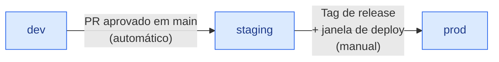

[← Voltar para `docs/`](README.md)

# 🌐 Ambientes

> **Status:** 🔵 PLANEJADA — sincronizada com [handbook infrastructure/02-environments.md](https://github.com/ERP-Bem-Comum). Time de Infra: atualize o status quando os ambientes estiverem provisionados.

---

## 1. Inventário

| Ambiente | Propósito | Dados | Acesso | Status provisionamento |
|---|---|---|---|---|
| `dev` | Desenvolvimento local + CI | Sintéticos / anonimizados | Time de dev (total) | 🟢 Compose local disponível |
| `x99` | Sandbox interno de validação (VM `incus` no homelab) — equivale a um "dev avançado" | Sintéticos | Time de dev / infra | 🟢 Docker Compose na VM; validação ETL legado→core executada |
| `qa` | Homologação funcional econômica (PBE) | Sintéticos / anonimizados | Dev + QA + P.O. | 🟡 VPS Magalu (IaC + runbook prontos; a validar) |
| `staging` | Pré-produção, ensaios de release (espelha prod) | Dump anonimizado de prod | Dev + QA + P.O. | 🔵 a provisionar |
| `prod` | Produção (alta disponibilidade) | Reais | Operação restrita | 🟢 **AWS ECS** (ELB + múltiplas tasks da API + RDS) |

🔵 = planejado · 🟢 = provisionado e validado · 🔴 = divergência

---

## 2. Princípio do espelhamento

> **Staging deve ter a MESMA topologia que prod.** Sem exceção.

`qa` não é `staging`. O QA inicial pode ser single-node, sem HA e menor que
produção para acelerar validação funcional. Ele não serve para validar
concorrência, failover, performance, RPO/RTO de produção ou comportamento sob HA.

Sem negociação:

- ✅ Mesmo número de réplicas por serviço
- ✅ Mesmo modo de gerenciamento de DB (managed/HA, mesma classe de instância)
- ✅ Mesma camada de observabilidade
- ✅ Mesmas regras de rede
- ✅ Mesmos alertas configurados

Diferenças aceitas:

- Tamanho de instâncias (staging pode ser menor — mas não muito)
- Volume de dados
- Limites de rate limit (staging pode ser mais permissivo)

> **Por quê:** bugs de concorrência, condições de corrida, comportamento sob HA — só aparecem em ambiente realista. Staging "simplificado" mente.

---

## 3. Promoção entre ambientes

| Promoção | Trigger | Aprovação |
|---|---|---|
| `dev` → `qa` | Imagem versionada do serviço | Manual no bootstrap inicial |
| `qa` → `staging` | Release candidata validada funcionalmente | Automática quando o pipeline existir |
| `staging` → `prod` | Tag de release + janela de deploy | Manual (release manager) |

> ❌ **Nunca** deploy direto de `dev` para `prod`.

---

## 4. Dados em staging

Dump de produção é **anonimizado** antes de ser carregado em staging:

| Campo | Tratamento |
|---|---|
| Nomes de pessoas | Substituir por valores fictícios (`Fulano da Silva`, etc.) |
| CPF / CNPJ | Substituir por gerados válidos para teste |
| Email | Substituir por `<id>@example.local` |
| Telefone | Substituir por padrão fictício |
| Endereço | Manter cidade/UF, anonimizar resto |
| Valores financeiros | Preservar (auditoria de cálculo) |
| Datas | Preservar (auditoria temporal) |
| Tokens, secrets, chaves API | **NÃO copiar** |

> Ferramentas e scripts de anonimização: a definir com infra + security antes do primeiro carregamento de staging. **Quando definido, commitar em [`../platform/`](../platform/) ou em repo de tooling dedicado.**

---

## 5. Janelas de manutenção

| Ambiente | Janela | Comunicação |
|---|---|---|
| `dev` | Livre, sem SLA | Mensagem no canal do time |
| `staging` | Aviso de **1 dia útil** | Canal de QA + P.O. |
| `prod` | Janela formal pré-acordada | Comunicado oficial aos stakeholders |

---

## 6. Acesso e permissões

### 6.1. `dev`

- Time de dev tem acesso total (incluindo escrita)
- Reset/recreate frequente é OK
- Banco rodando localmente via [`../local/docker-compose.yml`](../local/docker-compose.yml)

### 6.1.1. `x99`

- **Sandbox interno** numa VM `incus` no homelab — Docker Compose, **dados sintéticos**
- Equivale a um "dev avançado / validação": exercita a stack completa
  (API + 5 workers + MySQL) num ambiente isolado
- Usado para validação end-to-end (ex.: ETL legado→core) antes de promover
- Descartável; recriar do zero é o plano de recuperação
- Dimensionamento: ver [`../runbooks/deploy-and-operations.md`](../runbooks/deploy-and-operations.md) §5

### 6.2. `staging`

- Dev: leitura + deploy via pipeline
- QA: acesso para executar testes
- P.O.: acesso para validação de UAT
- Acesso direto ao banco: leitura apenas (via user `readonly_bi`)

### 6.2.1. `qa`

- Ambiente econômico e descartável para homologação funcional
- VPS criada: `BV1-2-20`, Ubuntu 24.04, `br-ne1-a`
- Somente Caddy publica `80/443`; SSH restrito ao IP administrativo
- MySQL local na VPS; anexos devem usar Object Storage externo
- Runbook: [`../platform/vps-qa/README.md`](../platform/vps-qa/README.md)
- Limites conhecidos: sessões, JWT e parte do domínio ainda possuem estado volátil

### 6.3. `prod`

- **Acesso restrito** a um pequeno time de operação
- Roda em **AWS ECS** (alta disponibilidade): **ELB** + múltiplas tasks da API;
  banco **RDS** gerenciado; segredos no **Secrets Manager** (ver
  [`ADR-0003`](adr/0003-producao-aws-ecs.md))
- Mudanças **somente via CI/CD** (CodePipeline → CodeBuild → CodeDeploy); nunca
  editar Task Definition, banco ou configuração ad hoc no console
- A infra **traduz o `compose.yaml` do core-api** em ECS: 1 Task Definition +
  1 ECS Service por service (a API fica atrás do ELB; os 5 workers do profile
  `workers` são ECS Services **sem ELB**)
- Acesso ao banco: emergência apenas, com auditoria, via break-glass procedure (a definir pela infra + security)
- Documentos em **S3** (ADR-0019); e-mail via **Amazon SES (SMTP)**
- Detalhes específicos (conta, região, cluster ECS, ARNs) — **a confirmar com o time de infra**

---

## 7. SLAs internos

| Item | dev | x99 | qa | staging | prod |
|---|---|---|---|---|---|
| Disponibilidade | Best effort | Best effort | Best effort | 99% | **99,9%** |
| RPO (Recovery Point) | 1 dia | n/a (descartável) | 24 horas | 4 horas | **15 minutos** |
| RTO (Recovery Time) | 4 horas | n/a (descartável) | 4 horas | 1 hora | **30 minutos** |

> Os valores de produção são o alvo de **alta disponibilidade** entregue pelo
> AWS ECS ([ADR-0003](adr/0003-producao-aws-ecs.md)): ELB + múltiplas tasks da
> API + RDS gerenciado (backup/PITR). A antiga exceção econômica single-node
> (ADR-0002) foi descartada.

---

## 8. Referências

- [`topology.md`](topology.md) — diagrama de componentes (aplicável em todos os ambientes)
- [`secrets.md`](secrets.md) — segredos por ambiente
- [`observability.md`](observability.md) — alertas e SLOs por ambiente
- Handbook `infrastructure/02-environments.md` — fonte canônica
