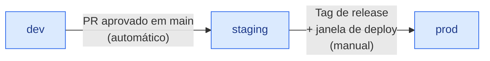

[← Voltar para `docs/`](README.md)

# 🌐 Ambientes

> **Status:** 🔵 PLANEJADA — sincronizada com [handbook infrastructure/02-environments.md](https://github.com/ERP-Bem-Comum). Time de Infra: atualize o status quando os ambientes estiverem provisionados.

---

## 1. Inventário

| Ambiente | Propósito | Dados | Acesso | Status provisionamento |
|---|---|---|---|---|
| `dev` | Desenvolvimento local + CI | Sintéticos / anonimizados | Time de dev (total) | 🔵 a provisionar |
| `staging` | Pré-produção, ensaios de release | Dump anonimizado de prod | Dev + QA + P.O. | 🔵 a provisionar |
| `prod` | Produção | Reais | Operação restrita | 🔵 a provisionar |

🔵 = planejado · 🟢 = provisionado e validado · 🔴 = divergência

---

## 2. Princípio do espelhamento

> **Staging deve ter a MESMA topologia que prod.** Sem exceção.

Sem negociação:

- ✅ Mesmo número de réplicas por serviço
- ✅ Mesmo modo de gerenciamento de DB (managed/HA, mesma classe de instância)
- ✅ Mesma camada de observabilidade
- ✅ Mesmas regras de rede
- ✅ Mesmos alertas configurados

Diferenças aceitas:

- Tamanho de instâncias (staging pode ser menor — mas não muito)
- Volume de dados
- Limites de rate limit (staging pode ser mais permissivo)

> **Por quê:** bugs de concorrência, condições de corrida, comportamento sob HA — só aparecem em ambiente realista. Staging "simplificado" mente.

---

## 3. Promoção entre ambientes

| Promoção | Trigger | Aprovação |
|---|---|---|
| `dev` → `staging` | PR aprovado em `main` do serviço | Automática via CI/CD |
| `staging` → `prod` | Tag de release + janela de deploy | Manual (release manager) |

> ❌ **Nunca** deploy direto de `dev` para `prod`.

---

## 4. Dados em staging

Dump de produção é **anonimizado** antes de ser carregado em staging:

| Campo | Tratamento |
|---|---|
| Nomes de pessoas | Substituir por valores fictícios (`Fulano da Silva`, etc.) |
| CPF / CNPJ | Substituir por gerados válidos para teste |
| Email | Substituir por `<id>@example.local` |
| Telefone | Substituir por padrão fictício |
| Endereço | Manter cidade/UF, anonimizar resto |
| Valores financeiros | Preservar (auditoria de cálculo) |
| Datas | Preservar (auditoria temporal) |
| Tokens, secrets, chaves API | **NÃO copiar** |

> Ferramentas e scripts de anonimização: a definir com infra + security antes do primeiro carregamento de staging. **Quando definido, commitar em [`../platform/`](../platform/) ou em repo de tooling dedicado.**

---

## 5. Janelas de manutenção

| Ambiente | Janela | Comunicação |
|---|---|---|
| `dev` | Livre, sem SLA | Mensagem no canal do time |
| `staging` | Aviso de **1 dia útil** | Canal de QA + P.O. |
| `prod` | Janela formal pré-acordada | Comunicado oficial aos stakeholders |

---

## 6. Acesso e permissões

### 6.1. `dev`

- Time de dev tem acesso total (incluindo escrita)
- Reset/recreate frequente é OK
- Banco rodando localmente via [`../local/docker-compose.yml`](../local/docker-compose.yml)

### 6.2. `staging`

- Dev: leitura + deploy via pipeline
- QA: acesso para executar testes
- P.O.: acesso para validação de UAT
- Acesso direto ao banco: leitura apenas (via user `readonly_bi`)

### 6.3. `prod`

- **Acesso restrito** a um pequeno time de operação
- Mudanças via pipeline — **nunca** SSH/manual
- Acesso ao banco: emergência apenas, com auditoria, via break-glass procedure (a definir pela infra + security)

---

## 7. SLAs internos

| Item | dev | staging | prod |
|---|---|---|---|
| Disponibilidade | Best effort | 99% | 99.9% |
| RPO (Recovery Point) | 1 dia | 4 horas | 15 minutos |
| RTO (Recovery Time) | 4 horas | 1 hora | 30 minutos |

> Valores conservadores iniciais. Revisar após primeiros 3 meses em prod.

---

## 8. Referências

- [`topology.md`](topology.md) — diagrama de componentes (aplicável em todos os ambientes)
- [`secrets.md`](secrets.md) — segredos por ambiente
- [`observability.md`](observability.md) — alertas e SLOs por ambiente
- Handbook `infrastructure/02-environments.md` — fonte canônica
