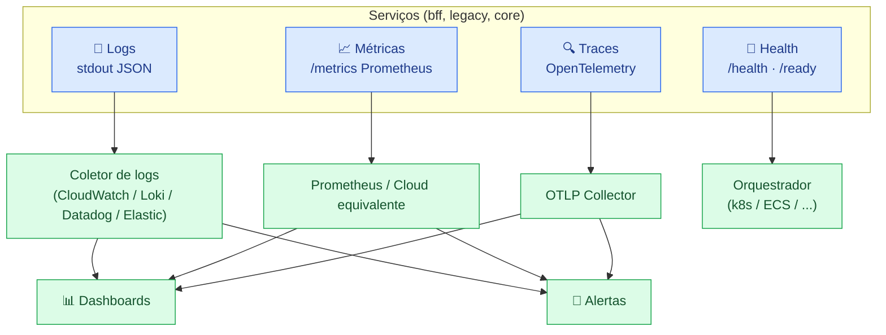

[← Voltar para `docs/`](README.md)

# 📊 Observabilidade — Baseline

> **Status:** 🔵 PLANEJADA — sincronizada com [handbook infrastructure/04-observability-baseline.md](https://github.com/ERP-Bem-Comum). Time de Infra: atualize quando a stack de observabilidade estiver provisionada.

---

## 1. Os 4 pilares



---

## 2. Logs

### Formato

- **stdout JSON estruturado** (não stderr; orquestradores tratam stdout de forma previsível)
- Cada linha = 1 evento
- Campos mínimos:
  - `timestamp` (ISO 8601 com timezone)
  - `level` (`debug`/`info`/`warn`/`error`/`fatal`)
  - `service` (`bff-gateway`/`legacy-api`/`core-api`)
  - `request_id` (correlação)
  - `message` (texto humano)
  - Campos contextuais (`user_id`, `tenant_id`, `operation`, etc.)

### O que NÃO logar

- ❌ CPF, CNS, NIS, RG ou qualquer dado pessoal identificável
- ❌ Tokens, senhas, chaves
- ❌ Body completo de request/response (sample sim, completo nunca)
- ❌ Stack traces em `info`/`warn` (só `error`/`fatal`)

### Coletor

🔵 **A definir** pelo time de infra. Candidatos:

- AWS CloudWatch Logs
- GCP Cloud Logging
- Grafana Loki
- Datadog Logs
- Elastic Stack

---

## 3. Métricas

### Exposição

Cada serviço expõe `GET /metrics` no formato Prometheus:

```
# HELP http_request_duration_seconds Latency in seconds
# TYPE http_request_duration_seconds histogram
http_request_duration_seconds_bucket{method="GET",route="/api/v2/documentos",status="200",le="0.1"} 1234
...
```

### Métricas RED por serviço (mínimo)

- **Rate** — requisições por segundo, por endpoint
- **Errors** — taxa de erro 5xx por endpoint
- **Duration** — latência p50/p95/p99 por endpoint

### Métricas USE para infra (mínimo)

- **Utilization** — CPU, memória, conexões DB
- **Saturation** — fila de outbox pendente, tempo médio na fila
- **Errors** — erros não-HTTP (timeouts, panics, retries)

### Métricas de negócio (a adicionar progressivamente)

- Total de remessas CNAB geradas / hora
- Total de retornos CNAB processados / hora
- Falhas de integração Bradesco por dia
- ... (cada bounded context contribui as suas)

---

## 4. Tracing

- **OpenTelemetry** — vendor-neutral, vai aonde a infra escolher (Jaeger, Tempo, X-Ray, Cloud Trace, Datadog APM, etc.)
- **Sampling:**
  - dev: 100%
  - staging: 100%
  - prod: 10% (configurável; pode subir temporariamente para investigação)
- **Propagação de contexto** via header `traceparent` (W3C Trace Context) — `bff-gateway` injeta, demais serviços propagam

### Spans mínimos

- HTTP request (root span no `bff-gateway`)
- Cada chamada inter-serviço (BFF → legacy/core)
- Cada query SQL (com tabela e operação, **sem valores**)
- Cada chamada externa (Bradesco, OCR, ...)
- Cada item de outbox processado pelo worker

---

## 5. Health checks

| Endpoint | Propósito | Resposta esperada |
|---|---|---|
| `/health` (liveness) | "O processo está vivo?" | 200 sempre que o processo conseguir responder. Não chama dependências. |
| `/ready` (readiness) | "O serviço está pronto para tráfego?" | 200 se DB respondendo + secrets carregados. 503 caso contrário. |

Orquestrador (k8s, ECS, etc.) consome:

- **Liveness** → reinicia o pod se falhar (alta tolerância: 3 falhas seguidas)
- **Readiness** → tira do LB enquanto falhar (baixa tolerância: 1 falha)

---

## 6. Alertas críticos

| Alerta | Condição | Severidade | Ação |
|---|---|---|---|
| Serviço down | `/health` falha por 1 min | 🔴 Crítica | Page on-call |
| Latência p95 elevada | > 1s por 5 min | 🟠 Alta | Notificar canal |
| Taxa de erro 5xx | > 1% em 5 min | 🟠 Alta | Notificar canal |
| Outbox pendente crescendo | > 1000 itens por 10 min | 🟠 Alta | Investigar worker |
| Outbox dead-letter | Qualquer entrada nova | 🔴 Crítica | Page on-call |
| DB CPU | > 80% por 10 min | 🟡 Média | Notificar canal |
| DB conexões | > 80% do limite por 5 min | 🟡 Média | Notificar canal |
| Latência Bradesco | > 5s por 5 min | 🟡 Média | Notificar canal |

Configuração detalhada: 🔵 a fazer pela infra junto com a stack de alertas escolhida.

---

## 7. Dashboards mínimos

Por serviço:

- **Overview** — RED metrics + erros recentes + utilização
- **Endpoint detail** — latência e taxa de erro por endpoint
- **Dependencies** — chamadas a DB, outros serviços, externos

Globais:

- **Funil de outbox** — gerados → processados → dead-letter
- **Integração Bradesco** — sucessos/falhas, latência, retentativas
- **Custo** — opcional, útil para cloud (a definir)

---

## 8. Runbooks

🔵 **A criar conforme incidentes acontecerem.** Local recomendado: `docs/runbooks/<alerta>.md` neste repo (não criado ainda — abrir quando o primeiro alerta for definido).

---

## 9. Referências

- [`topology.md`](topology.md) — quais serviços emitem o quê
- [`environments.md`](environments.md) — sampling e retenção por ambiente
- Handbook `infrastructure/04-observability-baseline.md` — fonte canônica
