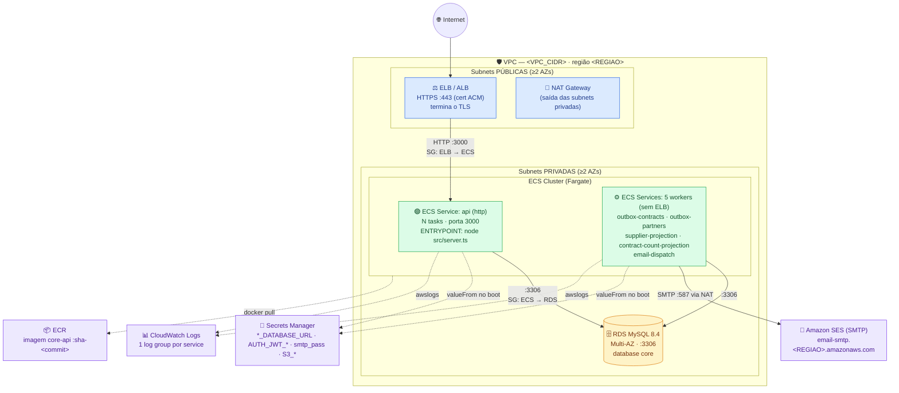
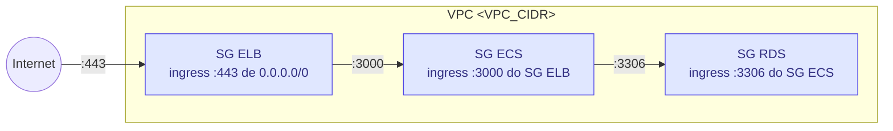
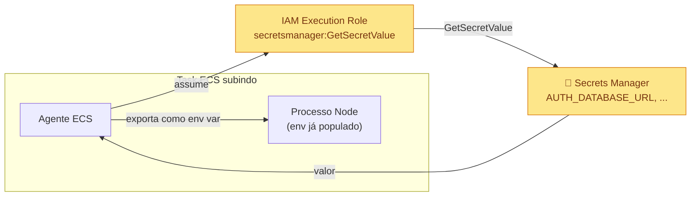
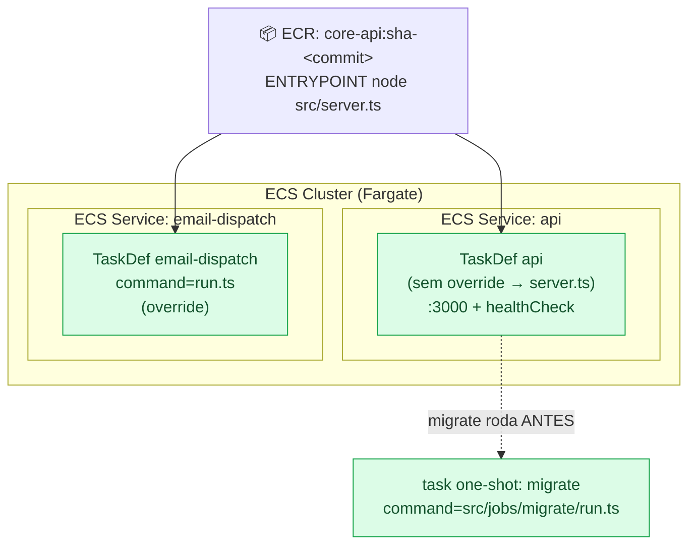
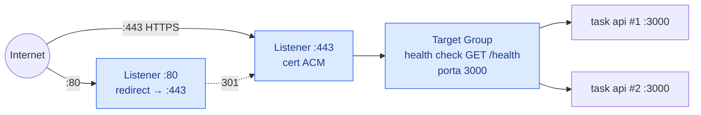
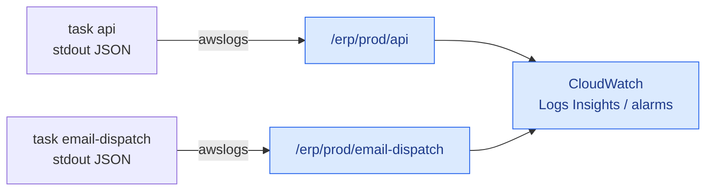

[← Voltar para `docs/`](../README.md)

# 🧱 Arquitetura de Produção AWS ECS — camada por camada (guia didático)

| | |
|---|---|
| **Tipo** | Guia de referência didático (explica a infra de prod do zero, camada a camada) |
| **Decisão-mãe** | [`ADR-0003 — Produção em AWS ECS`](../adr/0003-producao-aws-ecs.md) |
| **Público** | Dev ou pessoa de infra que **nunca mexeu em ECS** e quer entender como a prod do ERP Bem Comum é montada |
| **Status** | 🔵 PLANEJADA/REFERÊNCIA — descreve o **alvo** de [`ADR-0003`](../adr/0003-producao-aws-ecs.md). A IaC real do ECS é mantida pelo time de infra. |

> ### ⚠️ Sobre os valores nos exemplos
> Todo exemplo de código abaixo usa **placeholders** — `<REGIAO>`, `<ACCOUNT_ID>`,
> `<VPC_CIDR>`, `arn:aws:...:<...>`, nomes de cluster/recursos genéricos. **Os
> valores reais (conta AWS, região, ARNs, classe da instância RDS, nome do
> cluster ECS, repositório ECR) são _a confirmar com o time de infra_.** O código
> serve para **ensinar o formato e a ligação entre camadas**, não para dar
> `terraform apply` como está. A linguagem dos exemplos é **Terraform/HCL** (provider
> `hashicorp/aws`) e **JSON** (ECS Task Definition) — o repositório já usa
> [OpenTofu](../../platform/tofu/) (que lê o mesmo HCL) para o ambiente `qa`.

---

## 0. A ideia central antes de mergulhar

O `core-api` descreve **toda a sua topologia de processos** num único arquivo:
[`compose.yaml`](../../../core-api/compose.yaml) — a **"planta"**. Nela há um serviço
HTTP (`http`), cinco workers long-running e jobs one-shot (incluindo o `migrate`).
A produção **não reinventa** essa planta: ela **traduz** cada `service` do compose
em recursos AWS. A regra de tradução (de [`ADR-0003`](../adr/0003-producao-aws-ecs.md)):

| Na planta (`compose.yaml`)         | Em produção (AWS ECS)                                       |
| ---------------------------------- | ----------------------------------------------------------- |
| cada `service` de aplicação        | **1 Task Definition + 1 ECS Service** (mesma imagem do ECR) |
| `http` (profile `app`)             | ECS Service **atrás do ELB** (porta `:3000`)                |
| os 5 workers (profile `workers`)   | 1 ECS Service **cada, sem ELB** (não expõem porta)          |
| `migrate` (profile `jobs`)         | task one-shot **antes** de promover os Services             |
| `mysql`                            | **RDS** (MySQL 8.4 gerenciado)                              |
| `edge`/Caddy                       | **ELB/ALB**                                                 |
| `secrets:` (arquivos `*.txt`)      | **Secrets Manager**                                         |
| `minio`                            | **S3**                                                      |

**Uma imagem, vários papéis.** Todos os serviços usam a **mesma imagem** do ECR
(a do core-api). O que muda entre eles é só **qual processo Node sobe** — o
`command`. O [`Dockerfile`](../../../core-api/Dockerfile) tem
`ENTRYPOINT ["tini", "--", "node", "src/server.ts"]`: por padrão a imagem sobe a
**API**. Cada worker **sobrescreve** isso para subir o seu `run.ts`. Guarde essa
frase — ela reaparece na [Camada 4](#camada-4--orquestração-ecs-cluster-task-definition-service).

---

## 1. Diagrama geral (todas as camadas juntas)



**Como ler o diagrama (fluxo de uma request):** a Internet só enxerga o **ELB**
(camada 5). O ELB termina o TLS e encaminha para uma das **N tasks** da API
(camada 4), que rodam em **subnets privadas** (camada 1) — sem IP público. A API
fala com o **RDS** (camada 2) na porta 3306, e ambos só conversam porque um
**security group** permite (camada 1). Os segredos (senha do banco, chave JWT)
vêm do **Secrets Manager** (camada 3) no momento em que a task sobe. Os **5
workers** rodam sem ELB; o `email-dispatch` ainda sai para o **Amazon SES** via
NAT. Tudo (API + workers) joga log no **CloudWatch** (camada 6).

As próximas seções abrem **uma camada de cada vez**.

---

## Camada 1 — Rede (VPC)

### (a) O que é e por quê

A **VPC** (_Virtual Private Cloud_) é a sua "rede privada dentro da AWS". Tudo o
que você cria (ECS, RDS, ELB) nasce **dentro** dela. A VPC é fatiada em **subnets**:

- **Subnets públicas** — têm rota para a **Internet Gateway (IGW)**, logo podem
  ter IP público. É onde mora o **ELB** (precisa receber tráfego da Internet) e o
  **NAT Gateway**.
- **Subnets privadas** — **não** têm rota direta da Internet para dentro. É onde
  moram as **tasks do ECS** (API + workers) e o **RDS**. Elas saem para a Internet
  (puxar imagem, falar com SES) **através do NAT**, mas ninguém de fora inicia
  conexão com elas. Esse é o ponto de segurança: o banco e a aplicação **nunca**
  ficam expostos.

Para **alta disponibilidade**, criamos subnets em **pelo menos 2 zonas de
disponibilidade (AZs)** — se uma AZ cai, a outra atende.

O que decide **quem fala com quem** são os **security groups (SG)** — firewalls
a nível de recurso, com regra de _allow_ explícita:

- `SG do ELB` — aceita `:443` da Internet.
- `SG do ECS` — aceita `:3000` **apenas vindo do SG do ELB** (não da Internet).
- `SG do RDS` — aceita `:3306` **apenas vindo do SG do ECS**.

Repare que as regras se referenciam por **ID de outro SG**, não por IP. Isso é o
"encadeamento" que mantém o banco inalcançável de fora.

### (b) Diagrama da camada



### (c) Exemplo de código — Terraform/HCL

```hcl
# platform/tofu/modules/aws-network/main.tf  (ALVO — a confirmar com infra)
#
# Valores reais (CIDRs, região, AZs): A CONFIRMAR COM O TIME DE INFRA.

locals {
  name   = "erp-${var.environment}"          # ex.: erp-prod
  azs    = ["${var.region}a", "${var.region}b"]  # ≥2 AZs p/ HA
  tags = {
    Environment = var.environment
    Service     = "core-api"
    Owner       = "infra"
    Repo        = "ERP-INFRA"
  }
}

resource "aws_vpc" "this" {
  cidr_block           = var.vpc_cidr            # ex.: "10.20.0.0/16"
  enable_dns_support   = true
  enable_dns_hostnames = true
  tags                 = merge(local.tags, { Name = "${local.name}-vpc" })
}

resource "aws_internet_gateway" "this" {
  vpc_id = aws_vpc.this.id
  tags   = merge(local.tags, { Name = "${local.name}-igw" })
}

# --- Subnets públicas (ELB + NAT) — uma por AZ ---
resource "aws_subnet" "public" {
  for_each                = toset(local.azs)
  vpc_id                  = aws_vpc.this.id
  availability_zone       = each.value
  cidr_block              = cidrsubnet(var.vpc_cidr, 8, index(local.azs, each.value))
  map_public_ip_on_launch = true
  tags = merge(local.tags, { Name = "${local.name}-public-${each.value}", Tier = "public" })
}

# --- Subnets privadas (ECS + RDS) — uma por AZ ---
resource "aws_subnet" "private" {
  for_each          = toset(local.azs)
  vpc_id            = aws_vpc.this.id
  availability_zone = each.value
  cidr_block        = cidrsubnet(var.vpc_cidr, 8, index(local.azs, each.value) + 10)
  tags = merge(local.tags, { Name = "${local.name}-private-${each.value}", Tier = "private" })
}

# --- NAT: saída controlada das subnets privadas p/ a Internet ---
resource "aws_eip" "nat" {
  domain = "vpc"
  tags   = merge(local.tags, { Name = "${local.name}-nat-eip" })
}

resource "aws_nat_gateway" "this" {
  allocation_id = aws_eip.nat.id
  subnet_id     = values(aws_subnet.public)[0].id   # NAT vive numa subnet pública
  tags          = merge(local.tags, { Name = "${local.name}-nat" })
}

# ───────────────── Security Groups (o "quem fala com quem") ─────────────────

# SG do ELB: recebe HTTPS da Internet.
resource "aws_security_group" "elb" {
  name_prefix = "${local.name}-elb-"
  vpc_id      = aws_vpc.this.id
  tags        = merge(local.tags, { Name = "${local.name}-elb-sg" })
}

resource "aws_vpc_security_group_ingress_rule" "elb_https" {
  security_group_id = aws_security_group.elb.id
  description       = "HTTPS publico"
  cidr_ipv4         = "0.0.0.0/0"
  from_port         = 443
  to_port           = 443
  ip_protocol       = "tcp"
}

# SG das tasks ECS: aceita a PORTA DA APP (3000) SÓ vindo do SG do ELB.
resource "aws_security_group" "ecs" {
  name_prefix = "${local.name}-ecs-"
  vpc_id      = aws_vpc.this.id
  tags        = merge(local.tags, { Name = "${local.name}-ecs-sg" })
}

resource "aws_vpc_security_group_ingress_rule" "ecs_from_elb" {
  security_group_id            = aws_security_group.ecs.id
  description                  = "App :3000 vindo SOMENTE do ELB"
  referenced_security_group_id = aws_security_group.elb.id   # <- referência por SG, não por IP
  from_port                    = 3000
  to_port                      = 3000
  ip_protocol                  = "tcp"
}

# Egress liberado (puxar imagem do ECR via NAT, falar com SES/Secrets Manager).
resource "aws_vpc_security_group_egress_rule" "ecs_all" {
  security_group_id = aws_security_group.ecs.id
  cidr_ipv4         = "0.0.0.0/0"
  ip_protocol       = "-1"
}

# SG do RDS: aceita 3306 SÓ vindo das tasks ECS. Ninguém mais toca no banco.
resource "aws_security_group" "rds" {
  name_prefix = "${local.name}-rds-"
  vpc_id      = aws_vpc.this.id
  tags        = merge(local.tags, { Name = "${local.name}-rds-sg" })
}

resource "aws_vpc_security_group_ingress_rule" "rds_from_ecs" {
  security_group_id            = aws_security_group.rds.id
  description                  = "MySQL :3306 vindo SOMENTE das tasks ECS"
  referenced_security_group_id = aws_security_group.ecs.id
  from_port                    = 3306
  to_port                      = 3306
  ip_protocol                  = "tcp"
}
```

### (d) Como conecta com as outras camadas

- O **ELB** (camada 5) nasce nas **subnets públicas** e usa o `aws_security_group.elb`.
- As **tasks ECS** (camada 4) e o **RDS** (camada 2) nascem nas **subnets privadas**
  e usam `aws_security_group.ecs` / `aws_security_group.rds`.
- O encadeamento `ELB → ECS:3000 → RDS:3306` é exatamente o caminho da request do
  [diagrama geral](#1-diagrama-geral-todas-as-camadas-juntas).
- O **NAT** é o que permite o worker `email-dispatch` (camada 4) sair para o
  **SES** e qualquer task puxar imagem do **ECR**.

---

## Camada 2 — Banco (RDS MySQL 8.4)

### (a) O que é e por quê

O **RDS** (_Relational Database Service_) é o MySQL **gerenciado** pela AWS: ela
cuida de backup, _point-in-time recovery_ (PITR), patch de versão e **failover**.
Na planta local isso era o container `mysql:8.4`; em prod vira RDS — mas **a mesma
versão e o mesmo dialeto** (MySQL 8.4, ADR-0013/0020).

Peças de um RDS:

- **DB instance** — a instância em si (classe = CPU/RAM, ex.: `db.t3.medium`).
- **Multi-AZ** — a AWS mantém uma réplica _standby_ em outra AZ e faz failover
  automático. É o que entrega o RTO/RPO de prod ([`environments.md`](../environments.md) §7).
- **DB subnet group** — diz **em quais subnets** (as privadas, ≥2 AZs) o RDS pode
  viver. Sem isso não há Multi-AZ.
- **Parameter group** — o `my.cnf` gerenciado: aqui forçamos `utf8mb4` e o
  `sql_mode` rígido, espelhando o
  [`server.cnf`](../../../core-api/docker/mysql/conf.d/) do dev.
- **Security group** — o `aws_security_group.rds` da camada 1 (só ECS entra).

> 🔑 **Um banco, um database `core`, vários módulos.** O core-api é um _modular
> monolith_: cada módulo (auth, contracts, partners, financial, programs) tem sua
> própria **connection string** (`AUTH_DATABASE_URL`, `CONTRACTS_DATABASE_URL`,
> …), mas todas apontam para o **mesmo RDS / database `core`** — o isolamento é
> por **prefixo de tabela** (`ctr_*`, `fin_*`) e por GRANT, não por instância
> (ADR-0014). Essas URLs são **segredos** e vivem na camada 3.

### (b) Exemplo de código — Terraform/HCL

```hcl
# platform/tofu/modules/aws-rds/main.tf  (ALVO — a confirmar com infra)
#
# Classe da instância, storage, janelas de backup: A CONFIRMAR COM O TIME DE INFRA.

# Em quais subnets o RDS pode viver — as PRIVADAS, ≥2 AZs (Multi-AZ).
resource "aws_db_subnet_group" "this" {
  name       = "erp-${var.environment}-db-subnets"
  subnet_ids = [for s in aws_subnet.private : s.id]
  tags       = local.tags
}

# Parameter group: charset + sql_mode espelhando o dev (ADR-0014/0020).
resource "aws_db_parameter_group" "this" {
  name   = "erp-${var.environment}-mysql84"
  family = "mysql8.4"

  parameter {
    name  = "character_set_server"
    value = "utf8mb4"
  }
  parameter {
    name  = "collation_server"
    value = "utf8mb4_unicode_ci"
  }
  parameter {
    name  = "sql_mode"
    value = "STRICT_ALL_TABLES,NO_ENGINE_SUBSTITUTION,ONLY_FULL_GROUP_BY"
  }
  tags = local.tags
}

resource "aws_db_instance" "this" {
  identifier     = "erp-mysql-${var.environment}"   # ex.: erp-mysql-prod
  engine         = "mysql"
  engine_version = "8.4"                              # ADR-0013/0020
  instance_class = var.rds_instance_class             # ex.: "db.t3.medium" — A CONFIRMAR

  allocated_storage     = var.rds_storage_gb          # ex.: 50
  max_allocated_storage = var.rds_storage_max_gb      # autoscaling de storage
  storage_type          = "gp3"
  storage_encrypted     = true

  # --- Alta disponibilidade ---
  multi_az = true                                     # standby em outra AZ + failover

  # --- Rede (camada 1) ---
  db_subnet_group_name   = aws_db_subnet_group.this.name
  vpc_security_group_ids = [aws_security_group.rds.id] # só o SG do ECS entra
  publicly_accessible    = false                      # NUNCA exposto à Internet

  # --- Config (parameter group acima) ---
  parameter_group_name = aws_db_parameter_group.this.name
  db_name              = "core"                        # database único (ADR-0014)

  # --- Credenciais: a AWS pode gerar e guardar no Secrets Manager (camada 3) ---
  username                     = "admin"
  manage_master_user_password  = true                 # senha gerenciada → Secrets Manager

  # --- Backup / recuperação (RPO/RTO de prod) ---
  backup_retention_period = 7
  deletion_protection     = true
  skip_final_snapshot     = false
  final_snapshot_identifier = "erp-mysql-${var.environment}-final"

  tags = merge(local.tags, { Name = "erp-mysql-${var.environment}" })
}
```

### (c) Como isso vira as `*_DATABASE_URL` do core-api

O endpoint do RDS (`aws_db_instance.this.address`) é o **host** que entra na
connection string que cada módulo lê. O formato (do
[`secrets.md`](../secrets.md) §2.1) é:

```
mysql://core_app:<senha>@<endpoint-do-rds>:3306/core?ssl-mode=REQUIRED
```

Essa string **não** fica no Terraform do RDS em texto plano — ela é montada e
guardada no **Secrets Manager** (camada 3), e o ECS a injeta como
`AUTH_DATABASE_URL` / `CONTRACTS_DATABASE_URL` / … na task (camada 4). O job
`migrate` roda **antes** dos Services e usa `MIGRATE_DATABASE_URL` para aplicar o
schema nesse mesmo RDS.

### (d) Como conecta com as outras camadas

- **Camada 1:** vive nas subnets privadas, protegido pelo `SG RDS` (só ECS entra).
- **Camada 3:** a senha (e as URLs por módulo) moram no Secrets Manager.
- **Camada 4:** a API e os workers abrem conexão `mysql2` para o endpoint; o job
  `migrate` aplica as migrations aqui antes de qualquer Service subir.

---

## Camada 3 — Secrets (Secrets Manager + IAM)

### (a) O que é e por quê

No dev local, os segredos eram **arquivos** `./secrets/*.txt` montados em
`/run/secrets/...` (ADR-0011). Em prod isso vira o **AWS Secrets Manager**: um
cofre gerenciado, com **rotação** e **audit log**, e — crucialmente — o segredo
**nunca** entra na imagem Docker, em env literal no Terraform, nem em log.

Quais segredos o core-api precisa (do
[`env-and-secrets.reference.yaml`](../env-and-secrets.reference.yaml)):

| Slot (Secrets Manager)                 | Quem usa                                | Tipo     |
| -------------------------------------- | --------------------------------------- | -------- |
| `AUTH_DATABASE_URL`                    | API, worker `email-dispatch`            | DB URL   |
| `CONTRACTS_DATABASE_URL`               | API, `outbox-contracts`, `contract-count-projection` | DB URL |
| `PARTNERS_DATABASE_URL`                | API, `outbox-partners`, projeções       | DB URL   |
| `FINANCIAL_DATABASE_URL`               | API, `supplier-projection`              | DB URL   |
| `PROGRAMS_DATABASE_URL`                | API                                     | DB URL   |
| `MIGRATE_DATABASE_URL`                 | job `migrate`                           | DB URL   |
| `AUTH_JWT_PRIVATE_KEY`                 | API (assina ES256)                      | chave    |
| `SMTP_PASS`                            | worker `email-dispatch` (SES SMTP)      | senha    |
| `S3_ACCESS_KEY_ID` / `S3_SECRET_ACCESS_KEY` | API (ou IAM Role — ver abaixo)     | chave S3 |

> 💡 **Há dois papéis IAM no ECS — não confunda:**
> - **Execution role** (`executionRoleArn`) — usada pelo **agente do ECS** para
>   _puxar a imagem do ECR_, _ler os segredos do Secrets Manager_ e _escrever logs
>   no CloudWatch_. É **esta** role que lê o secret **na hora de subir a task** e
>   o injeta como env var. Sem a policy `secretsmanager:GetSecretValue` aqui, a
>   task **nem sobe**.
> - **Task role** (`taskRoleArn`) — usada pelo **seu código** em runtime (ex.: a
>   API chamando o **S3**). É o caminho preferido em prod para S3: dar uma task
>   role com permissão de S3 e **não** guardar `S3_ACCESS_KEY_ID` estático
>   (a credencial XOR do core-api aceita "sem key → usa IAM Role").

### (b) Diagrama da camada



### (c) Exemplo de código — Terraform/HCL

```hcl
# platform/tofu/modules/aws-secrets/main.tf  (ALVO — a confirmar com infra)
#
# ARNs reais dos segredos: A CONFIRMAR COM O TIME DE INFRA.

# 1) O "slot" do segredo (metadado: nome, política de rotação). SEM valor aqui.
resource "aws_secretsmanager_secret" "contracts_db_url" {
  name        = "erp/${var.environment}/CONTRACTS_DATABASE_URL"
  description = "Connection string do modulo contracts (core-api)"
  tags        = local.tags
}

# 2) A VERSÃO com o valor. Em prod o valor vem de fora (gerado na rotação,
#    montado a partir do endpoint do RDS) — NUNCA commitado. Aqui usamos uma
#    var marcada `sensitive` só para ilustrar; o time de infra injeta o real.
resource "aws_secretsmanager_secret_version" "contracts_db_url" {
  secret_id     = aws_secretsmanager_secret.contracts_db_url.id
  secret_string = var.contracts_database_url   # sensitive; NUNCA em texto no repo
}

# 3) A IAM EXECUTION ROLE que o ECS assume para LER os segredos no boot da task.
data "aws_iam_policy_document" "ecs_assume" {
  statement {
    actions = ["sts:AssumeRole"]
    principals {
      type        = "Service"
      identifiers = ["ecs-tasks.amazonaws.com"]
    }
  }
}

resource "aws_iam_role" "execution" {
  name               = "erp-${var.environment}-ecs-execution"
  assume_role_policy = data.aws_iam_policy_document.ecs_assume.json
  tags               = local.tags
}

# Policy gerenciada da AWS: pull do ECR + escrita no CloudWatch Logs.
resource "aws_iam_role_policy_attachment" "execution_base" {
  role       = aws_iam_role.execution.name
  policy_arn = "arn:aws:iam::aws:policy/service-role/AmazonECSTaskExecutionRolePolicy"
}

# Permissão EXPLÍCITA de ler SÓ os segredos do core-api (least privilege).
data "aws_iam_policy_document" "read_secrets" {
  statement {
    sid     = "ReadCoreApiSecrets"
    actions = ["secretsmanager:GetSecretValue"]
    resources = [
      aws_secretsmanager_secret.contracts_db_url.arn,
      # ...demais slots: AUTH_DATABASE_URL, AUTH_JWT_PRIVATE_KEY, SMTP_PASS, etc.
      "arn:aws:secretsmanager:<REGIAO>:<ACCOUNT_ID>:secret:erp/${var.environment}/*",
    ]
  }
}

resource "aws_iam_role_policy" "read_secrets" {
  name   = "read-core-api-secrets"
  role   = aws_iam_role.execution.id
  policy = data.aws_iam_policy_document.read_secrets.json
}
```

### (d) Como conecta com as outras camadas

- **Camada 2:** os valores `*_DATABASE_URL` são montados com o endpoint do RDS.
- **Camada 4:** a Task Definition referencia cada segredo por ARN no bloco
  `secrets` → `valueFrom`; o `executionRoleArn` da task **é** a role criada aqui.
  A `task role` (não mostrada) dá ao código permissão de **S3** sem chave estática.

---

## Camada 4 — Orquestração (ECS: cluster, Task Definition, Service)

### (a) O que é e por quê

O **ECS** é o orquestrador: ele pega a sua imagem e **roda N cópias dela**,
reinicia o que morre, e integra com ELB e CloudWatch. Três conceitos:

1. **Cluster** — o agrupamento lógico onde as tasks rodam (em **Fargate**, sem
   gerenciar EC2).
2. **Task Definition** — a "receita" de **um** container: qual imagem, quanto de
   CPU/RAM, quais portas, quais env vars, **quais segredos**, para onde vão os
   logs, e — o ponto-chave — **`entryPoint` / `command`**.
3. **ECS Service** — mantém **N tasks** daquela Task Definition rodando o tempo
   todo, faz _rolling deploy_ e (para a API) registra as tasks no **target group**
   do ELB.

> 🎯 **`entryPoint` vs `command` — o coração da tradução "uma imagem, vários papéis".**
> A imagem do core-api tem `ENTRYPOINT ["tini", "--", "node", "src/server.ts"]` e
> **nenhum** `CMD`. Então:
> - **API (`http`):** a Task Definition **não sobrescreve nada** → roda
>   `node src/server.ts` (o servidor HTTP). É a única com `portMappings` e
>   `healthCheck` HTTP.
> - **Worker (ex.: `email-dispatch`):** a Task Definition **sobrescreve**
>   `entryPoint = ["tini","--","node"]` e `command = ["src/workers/email-dispatch/run.ts"]`
>   → roda o worker, **não** o servidor. (No compose isso era feito com um
>   `entrypoint: ['tini','--','node'] + command: [...]`; em ECS é idêntico, só que
>   declarado no JSON.) **Mesma imagem, processo diferente.**
>
> 📌 **Por que no ECS o worker fica mais simples que no compose?** No compose, os
> segredos eram arquivos e o worker usava um truque `sh -c "export X=$(cat
> /run/secrets/...); exec tini -- node ..."`. No ECS os segredos vêm pelo bloco
> `secrets`/`valueFrom` (camada 3) **já como env var** — então **não precisa do
> wrapper `sh`**: dá para chamar `node` direto via `entryPoint`/`command`.

### (b) Diagrama da camada



### (c1) Exemplo de código — Task Definition da API (JSON, comentado)

> JSON puro não aceita comentários; os `// ...` abaixo são **didáticos** —
> remova-os no arquivo real. Valores `<...>`: a confirmar com o time de infra.

```jsonc
{
  "family": "erp-prod-api",
  "requiresCompatibilities": ["FARGATE"],
  "networkMode": "awsvpc",
  "cpu": "512",                      // 0.5 vCPU — ver topology.md (≥2 réplicas)
  "memory": "1024",                  // 1 GB
  // Execution role (camada 3): pull do ECR + ler secrets + escrever logs.
  "executionRoleArn": "arn:aws:iam::<ACCOUNT_ID>:role/erp-prod-ecs-execution",
  // Task role: permissões do CÓDIGO em runtime (ex.: S3 sem key estática).
  "taskRoleArn": "arn:aws:iam::<ACCOUNT_ID>:role/erp-prod-api-task",
  "containerDefinitions": [
    {
      "name": "api",
      "image": "<ACCOUNT_ID>.dkr.ecr.<REGIAO>.amazonaws.com/core-api:sha-<commit>",
      "essential": true,

      // A API NÃO sobrescreve entryPoint/command:
      // usa o ENTRYPOINT da imagem → `tini -- node src/server.ts`.

      // Porta HTTP da API. SÓ a API tem portMappings (o ELB aponta p/ cá).
      "portMappings": [{ "containerPort": 3000, "protocol": "tcp" }],

      // Env NÃO-secreta (drivers do modular monolith = mysql).
      "environment": [
        { "name": "NODE_ENV",          "value": "production" },
        { "name": "AUTH_DRIVER",       "value": "mysql" },
        { "name": "PROGRAMS_DRIVER",   "value": "mysql" },
        { "name": "CONTRACTS_DRIVER",  "value": "mysql" },
        { "name": "PARTNERS_DRIVER",   "value": "mysql" },
        { "name": "FINANCIAL_DRIVER",  "value": "mysql" },
        { "name": "S3_REGION",         "value": "<REGIAO>" },
        { "name": "S3_BUCKET",         "value": "erp-prod-contracts-documents" }
      ],

      // Env SECRETA: o agente ECS resolve cada `valueFrom` no Secrets Manager
      // (camada 3) NA HORA DE SUBIR e injeta como env var. Nunca aparece em log.
      "secrets": [
        { "name": "AUTH_DATABASE_URL",      "valueFrom": "arn:aws:secretsmanager:<REGIAO>:<ACCOUNT_ID>:secret:erp/prod/AUTH_DATABASE_URL" },
        { "name": "PROGRAMS_DATABASE_URL",  "valueFrom": "arn:aws:secretsmanager:<REGIAO>:<ACCOUNT_ID>:secret:erp/prod/PROGRAMS_DATABASE_URL" },
        { "name": "CONTRACTS_DATABASE_URL", "valueFrom": "arn:aws:secretsmanager:<REGIAO>:<ACCOUNT_ID>:secret:erp/prod/CONTRACTS_DATABASE_URL" },
        { "name": "PARTNERS_DATABASE_URL",  "valueFrom": "arn:aws:secretsmanager:<REGIAO>:<ACCOUNT_ID>:secret:erp/prod/PARTNERS_DATABASE_URL" },
        { "name": "FINANCIAL_DATABASE_URL", "valueFrom": "arn:aws:secretsmanager:<REGIAO>:<ACCOUNT_ID>:secret:erp/prod/FINANCIAL_DATABASE_URL" },
        { "name": "AUTH_JWT_PRIVATE_KEY",   "valueFrom": "arn:aws:secretsmanager:<REGIAO>:<ACCOUNT_ID>:secret:erp/prod/AUTH_JWT_PRIVATE_KEY" }
      ],

      // Healthcheck idêntico ao do Dockerfile/compose (porta 3000, fetch /health).
      // O ECS marca a task unhealthy e a recicla se falhar.
      "healthCheck": {
        "command": ["CMD-SHELL", "node -e \"fetch('http://127.0.0.1:3000/health').then(r=>process.exit(r.ok?0:1)).catch(()=>process.exit(1))\""],
        "interval": 30,
        "timeout": 5,
        "retries": 3,
        "startPeriod": 15
      },

      // Logs → CloudWatch (camada 6). SEM este bloco, NENHUM log aparece.
      "logConfiguration": {
        "logDriver": "awslogs",
        "options": {
          "awslogs-group": "/erp/prod/api",
          "awslogs-region": "<REGIAO>",
          "awslogs-stream-prefix": "api"
        }
      }
    }
  ]
}
```

### (c2) Exemplo de código — Task Definition de um worker (`email-dispatch`)

```jsonc
{
  "family": "erp-prod-email-dispatch",
  "requiresCompatibilities": ["FARGATE"],
  "networkMode": "awsvpc",
  "cpu": "256",
  "memory": "512",
  "executionRoleArn": "arn:aws:iam::<ACCOUNT_ID>:role/erp-prod-ecs-execution",
  "containerDefinitions": [
    {
      "name": "email-dispatch",
      "image": "<ACCOUNT_ID>.dkr.ecr.<REGIAO>.amazonaws.com/core-api:sha-<commit>",
      "essential": true,

      // *** A DIFERENÇA-CHAVE ***  Sobrescreve o ENTRYPOINT da imagem para
      // rodar o worker em vez do servidor HTTP. Mesma imagem, processo diferente.
      "entryPoint": ["tini", "--", "node"],
      "command": ["src/workers/email-dispatch/run.ts"],

      // Worker NÃO tem portMappings nem healthCheck HTTP (não escuta porta).

      // E-mail via Amazon SES (SMTP) — contrato ADR-0010, igual nos 3 ambientes.
      "environment": [
        { "name": "NODE_ENV",       "value": "production" },
        { "name": "EMAIL_PROVIDER", "value": "smtp" },
        { "name": "EMAIL_FROM",     "value": "ERP Bem Comum <no-reply@bemcomum.org>" },
        { "name": "SMTP_HOST",      "value": "email-smtp.<REGIAO>.amazonaws.com" },
        { "name": "SMTP_PORT",      "value": "587" },
        { "name": "SMTP_SECURE",    "value": "false" },
        { "name": "SMTP_USER",      "value": "<SES_SMTP_USERNAME>" }
      ],
      "secrets": [
        { "name": "AUTH_DATABASE_URL",     "valueFrom": "arn:aws:secretsmanager:<REGIAO>:<ACCOUNT_ID>:secret:erp/prod/AUTH_DATABASE_URL" },
        { "name": "PARTNERS_DATABASE_URL", "valueFrom": "arn:aws:secretsmanager:<REGIAO>:<ACCOUNT_ID>:secret:erp/prod/PARTNERS_DATABASE_URL" },
        { "name": "SMTP_PASS",             "valueFrom": "arn:aws:secretsmanager:<REGIAO>:<ACCOUNT_ID>:secret:erp/prod/SMTP_PASS" }
      ],
      "logConfiguration": {
        "logDriver": "awslogs",
        "options": {
          "awslogs-group": "/erp/prod/email-dispatch",
          "awslogs-region": "<REGIAO>",
          "awslogs-stream-prefix": "worker"
        }
      }
    }
  ]
}
```

> Os outros 4 workers (`outbox-contracts`, `outbox-partners`,
> `supplier-projection`, `contract-count-projection`) seguem o **mesmo molde**:
> trocam só o `command` (qual `run.ts`) e os `secrets` que aquele worker precisa.
> Os de outbox usam `FOR UPDATE SKIP LOCKED` (ADR-0015), então o **Service**
> deles pode ter `desiredCount ≥ 2` **sem duplicar evento**; as projeções e o
> `email-dispatch` rodam com `desiredCount = 1`.

### (c3) Exemplo de código — Cluster + ECS Service (Terraform/HCL)

```hcl
# platform/tofu/modules/aws-ecs/main.tf  (ALVO — a confirmar com infra)

resource "aws_ecs_cluster" "this" {
  name = "erp-${var.environment}"        # ex.: erp-prod
  setting {
    name  = "containerInsights"
    value = "enabled"                     # métricas no CloudWatch (camada 6)
  }
  tags = local.tags
}

# A Task Definition (JSON acima) é registrada a partir de um arquivo/template.
resource "aws_ecs_task_definition" "api" {
  family                   = "erp-${var.environment}-api"
  requires_compatibilities = ["FARGATE"]
  network_mode             = "awsvpc"
  cpu                      = "512"
  memory                   = "1024"
  execution_role_arn       = aws_iam_role.execution.arn        # camada 3
  task_role_arn            = aws_iam_role.api_task.arn
  container_definitions    = file("${path.module}/taskdefs/api.json")
}

# O SERVICE: mantém N tasks vivas + registra no target group do ELB (camada 5).
resource "aws_ecs_service" "api" {
  name            = "api"
  cluster         = aws_ecs_cluster.this.id
  task_definition = aws_ecs_task_definition.api.arn
  desired_count   = 2                       # ≥2 réplicas (HA) — topology.md
  launch_type     = "FARGATE"

  # Tasks nas subnets PRIVADAS, com o SG do ECS (camada 1).
  network_configuration {
    subnets          = [for s in aws_subnet.private : s.id]
    security_groups  = [aws_security_group.ecs.id]
    assign_public_ip = false
  }

  # Só a API entra no ELB: liga o container:porta ao target group (camada 5).
  load_balancer {
    target_group_arn = aws_lb_target_group.api.arn
    container_name   = "api"
    container_port   = 3000
  }

  # Rolling deploy seguro: nunca derruba abaixo de 100% durante o deploy.
  deployment_minimum_healthy_percent = 100
  deployment_maximum_percent         = 200

  depends_on = [aws_lb_listener.https]
  tags       = local.tags
}

# Worker = Service SEM bloco load_balancer (não tem porta). Ex.: email-dispatch.
resource "aws_ecs_service" "email_dispatch" {
  name            = "email-dispatch"
  cluster         = aws_ecs_cluster.this.id
  task_definition = aws_ecs_task_definition.email_dispatch.arn
  desired_count   = 1
  launch_type     = "FARGATE"
  network_configuration {
    subnets         = [for s in aws_subnet.private : s.id]
    security_groups = [aws_security_group.ecs.id]
  }
  # SEM load_balancer{} — worker não recebe tráfego HTTP.
  tags = local.tags
}

# ---- Autoscaling da API (ex.: por CPU) ----
resource "aws_appautoscaling_target" "api" {
  service_namespace  = "ecs"
  resource_id        = "service/${aws_ecs_cluster.this.name}/${aws_ecs_service.api.name}"
  scalable_dimension = "ecs:service:DesiredCount"
  min_capacity       = 2
  max_capacity       = 6
}

resource "aws_appautoscaling_policy" "api_cpu" {
  name               = "erp-${var.environment}-api-cpu"
  service_namespace  = aws_appautoscaling_target.api.service_namespace
  resource_id        = aws_appautoscaling_target.api.resource_id
  scalable_dimension = aws_appautoscaling_target.api.scalable_dimension
  policy_type        = "TargetTrackingScaling"
  target_tracking_scaling_policy_configuration {
    predefined_metric_specification {
      predefined_metric_type = "ECSServiceAverageCPUUtilization"
    }
    target_value = 60   # mira 60% de CPU; sobe/desce tasks p/ manter
  }
}
```

### (d) Como conecta com as outras camadas

- **Camada 1:** as tasks sobem nas subnets privadas com o `SG ECS`.
- **Camada 2:** abrem conexão `mysql2` para o RDS; o `migrate` aplica o schema antes.
- **Camada 3:** `executionRoleArn` lê os `secrets` por `valueFrom`; `taskRoleArn`
  dá ao código permissão de S3/SES.
- **Camada 5:** **só** o Service `api` tem `load_balancer{}` → entra no target group.
- **Camada 6:** cada container manda log via `awslogs` para o log group dele.

---

## Camada 5 — Borda (ELB / ALB)

### (a) O que é e por quê

O **ELB** (aqui um **Application Load Balancer / ALB**, camada 7) é a **única
porta de entrada** pública. Ele:

1. **Termina o TLS** — apresenta o certificado (do **ACM**) e fala HTTPS com o
   browser; para dentro, fala HTTP simples na porta 3000 das tasks.
2. **Distribui** o tráfego entre as **N tasks** da API (round-robin / least-conn).
3. **Tira tasks doentes do rodízio** via **health check** — ele bate no `/health`
   da API e só manda tráfego para quem responde 200.

**Só a API usa o ELB.** Os 5 workers não escutam porta — não têm target group.

Peças: **load balancer** (nas subnets públicas), **target group** (o "pool" de
tasks da API, com o health check), **listener** `:443` (HTTPS + cert ACM) que
encaminha para o target group, e geralmente um listener `:80` que **redireciona**
para `:443`.

### (b) Diagrama da camada



### (c) Exemplo de código — Terraform/HCL

```hcl
# platform/tofu/modules/aws-elb/main.tf  (ALVO — a confirmar com infra)
#
# ARN do certificado ACM, domínio: A CONFIRMAR COM O TIME DE INFRA.

resource "aws_lb" "this" {
  name               = "erp-${var.environment}-alb"
  load_balancer_type = "application"
  internal           = false                                  # voltado p/ Internet
  subnets            = [for s in aws_subnet.public : s.id]    # subnets PÚBLICAS
  security_groups    = [aws_security_group.elb.id]            # SG ELB (camada 1)
  tags               = local.tags
}

# O "pool" de tasks da API + a definição do HEALTH CHECK.
resource "aws_lb_target_group" "api" {
  name        = "erp-${var.environment}-api-tg"
  port        = 3000                  # porta do container da API
  protocol    = "HTTP"
  vpc_id      = aws_vpc.this.id
  target_type = "ip"                  # Fargate (awsvpc) registra por IP

  health_check {
    path                = "/health"   # bate no /health da API (src/shared/http/app.ts)
    port                = "traffic-port"
    healthy_threshold   = 3
    unhealthy_threshold = 3
    interval            = 30
    timeout             = 5
    matcher             = "200"
  }
  tags = local.tags
}

# Listener HTTPS :443 — termina o TLS com o cert do ACM e manda p/ o target group.
resource "aws_lb_listener" "https" {
  load_balancer_arn = aws_lb.this.arn
  port              = 443
  protocol          = "HTTPS"
  ssl_policy        = "ELBSecurityPolicy-TLS13-1-2-2021-06"
  certificate_arn   = var.acm_certificate_arn   # arn:aws:acm:<REGIAO>:<ACCOUNT_ID>:certificate/<...>

  default_action {
    type             = "forward"
    target_group_arn = aws_lb_target_group.api.arn
  }
}

# Listener :80 → redireciona tudo p/ HTTPS (nunca serve HTTP puro).
resource "aws_lb_listener" "http_redirect" {
  load_balancer_arn = aws_lb.this.arn
  port              = 80
  protocol          = "HTTP"
  default_action {
    type = "redirect"
    redirect {
      port        = "443"
      protocol    = "HTTPS"
      status_code = "HTTP_301"
    }
  }
}
```

### (d) Como conecta com as outras camadas

- **Camada 1:** o ELB vive nas subnets públicas com o `SG ELB`; o `SG ECS` só
  aceita `:3000` **vindo deste ELB**.
- **Camada 4:** o `aws_ecs_service.api` referencia este `target_group_arn` no
  bloco `load_balancer{}` — é assim que as tasks entram/saem do rodízio.
- O health check `GET /health` é o **mesmo** endpoint que o ECS e o Dockerfile
  usam — definido em `src/shared/http/app.ts`.

---

## Camada 6 — Observabilidade (CloudWatch Logs)

### (a) O que é e por quê

Containers são **efêmeros**: quando uma task morre, o `stdout` dela vai junto. O
**CloudWatch Logs** captura esse `stdout` e **persiste** — é onde você lê o que a
API/worker imprimiu (o core-api loga **JSON estruturado em stdout**, ver
[`observability.md`](../observability.md) §2).

O mecanismo é o **log driver `awslogs`** declarado em **cada container** da Task
Definition (camada 4). Convenção: **um log group por service**
(`/erp/prod/api`, `/erp/prod/email-dispatch`, …), com **retenção** definida.

> 🚨 **A pegadinha clássica:** *"subi a task, mas não aparece nenhum log!"* — quase
> sempre é porque (1) **faltou o bloco `logConfiguration`/`awslogs`** no container,
> ou (2) o **log group não existe**, ou (3) a **execution role** não tem permissão
> de escrever no CloudWatch. Sem o driver `awslogs`, o `stdout` simplesmente
> **se perde**. Por isso o log group é criado na IaC (não "na primeira vez que
> escrever") e a `AmazonECSTaskExecutionRolePolicy` (camada 3) já inclui a
> permissão de logs.

### (b) Exemplo de código — Terraform/HCL (log group) + a ligação na task def

```hcl
# platform/tofu/modules/aws-observability/main.tf  (ALVO — a confirmar com infra)

# Um log group por service (API + cada worker). Crie ANTES das tasks.
resource "aws_cloudwatch_log_group" "api" {
  name              = "/erp/${var.environment}/api"
  retention_in_days = 30                # retenção — ajustar por política/custo
  tags              = local.tags
}

resource "aws_cloudwatch_log_group" "email_dispatch" {
  name              = "/erp/${var.environment}/email-dispatch"
  retention_in_days = 30
  tags              = local.tags
}
# ...idem para outbox-contracts, outbox-partners, supplier-projection,
#    contract-count-projection.
```

E o que **liga** a task ao log group é o bloco que já apareceu na camada 4 —
repetido aqui para fechar o circuito:

```jsonc
// dentro do containerDefinitions[].logConfiguration da Task Definition:
"logConfiguration": {
  "logDriver": "awslogs",
  "options": {
    "awslogs-group":         "/erp/prod/api",       // = o log group acima
    "awslogs-region":        "<REGIAO>",
    "awslogs-stream-prefix": "api"                   // prefixo do stream por task
  }
}
```

### (c) Diagrama da camada



### (d) Como conecta com as outras camadas

- **Camada 4:** o `logConfiguration` vive em cada container da Task Definition; o
  `awslogs-group` aponta para o log group criado aqui.
- **Camada 3:** a **execution role** precisa de permissão de escrita no CloudWatch
  (incluída na `AmazonECSTaskExecutionRolePolicy`).
- O baseline de **métricas/alertas/tracing** (RED, `/ready`, outbox pendente,
  OpenTelemetry) está em [`observability.md`](../observability.md) — esta camada
  cobre o **pilar de logs**; `containerInsights` (camada 4) cobre métricas de
  infra.

---

## 📋 Mapa-resumo: camada → recurso AWS → linguagem/arquivo → onde mora

| # | Camada | Recurso(s) AWS | Linguagem / arquivo (alvo) | Onde mora na VPC |
|---|--------|----------------|----------------------------|-------------------|
| 1 | **Rede (VPC)** | VPC, Subnets (pública/privada), IGW, NAT, Security Groups | Terraform/HCL · `platform/tofu/modules/aws-network/` | a VPC inteira |
| 2 | **Banco** | RDS MySQL 8.4, DB subnet group, parameter group | Terraform/HCL · `platform/tofu/modules/aws-rds/` | subnets **privadas** |
| 3 | **Secrets** | Secrets Manager, IAM execution role + task role | Terraform/HCL · `platform/tofu/modules/aws-secrets/` | global (lido no boot) |
| 4 | **Orquestração** | ECS Cluster, Task Definition, ECS Service, Auto Scaling | **JSON** (task def) + Terraform/HCL · `platform/tofu/modules/aws-ecs/` | subnets **privadas** (Fargate) |
| 5 | **Borda** | ALB/ELB, Target Group, Listener (443+ACM), redirect 80 | Terraform/HCL · `platform/tofu/modules/aws-elb/` | subnets **públicas** |
| 6 | **Observabilidade** | CloudWatch Log Groups, driver `awslogs`, Container Insights | Terraform/HCL (log group) + JSON (`logConfiguration`) · `platform/tofu/modules/aws-observability/` | global |

> Os caminhos `platform/tofu/modules/aws-*/` são o **layout sugerido** (módulo por
> preocupação, como recomenda [`platform/README.md`](../../platform/README.md)).
> A IaC real do ECS é mantida pelo time de infra; **conta, região, ARNs, classe
> do RDS, nome do cluster e repositório ECR são a confirmar com o time de infra.**

---

## 🔗 Referências

- [`adr/0003-producao-aws-ecs.md`](../adr/0003-producao-aws-ecs.md) — decisão-mãe (tradução `compose.yaml` → ECS).
- [`topology.md`](../topology.md) — visão de componentes e fluxos (alvo de HA).
- [`environments.md`](../environments.md) — dev/x99/qa/staging/prod e dimensionamento.
- [`secrets.md`](../secrets.md) + [`env-and-secrets.reference.yaml`](../env-and-secrets.reference.yaml) — catálogo de segredos (a referência verificada no código).
- [`observability.md`](../observability.md) — logs/métricas/tracing/alertas.
- [`runbooks/deploy-and-operations.md`](deploy-and-operations.md) §5 — deploy de prod (CodePipeline → CodeBuild → CodeDeploy).
- [`platform/README.md`](../../platform/README.md) — IaC real + convenções.
- Planta traduzida: [`core-api/compose.yaml`](../../../core-api/compose.yaml) · [`core-api/Dockerfile`](../../../core-api/Dockerfile).
</content>
</invoke>
