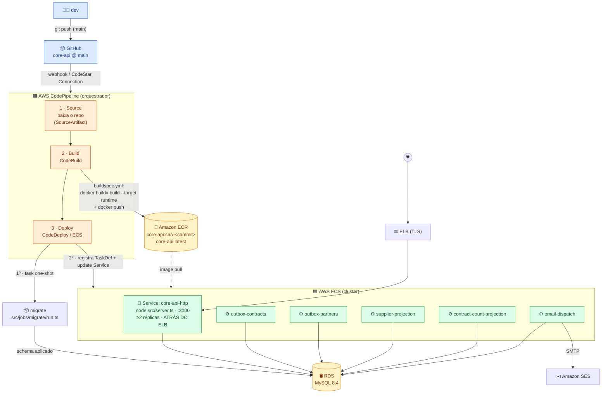
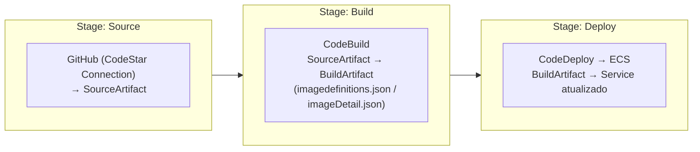

[← Voltar para `docs/`](../README.md)

# 🚚 Guia didático — Pipeline CI/CD de produção (AWS CodePipeline → ECS)

| | |
|---|---|
| **Tipo** | Guia didático (explica o pipeline peça por peça, com exemplos na linguagem de cada etapa) |
| **Donos** | Time de Infra (provisiona o pipeline) · Time do core-api (dono do `Dockerfile`/`compose.yaml`) |
| **Público** | Quem nunca viu o pipeline e precisa **entender o caminho de uma imagem do `git push` até o ECS** |
| **Decisão de base** | [`ADR-0003 — Produção AWS ECS`](../adr/0003-producao-aws-ecs.md) |
| **Operação do dia a dia** | [`deploy-and-operations.md` §5 (Prod AWS ECS)](deploy-and-operations.md#5-prod-aws-ecs) — rollback, troubleshooting, comandos AWS CLI |

> **Como ler este guia.** Cada etapa tem (1) uma explicação didática do *que* ela faz e *por quê*,
> e (2) um **exemplo de código na linguagem própria daquela etapa** — HCL (Terraform) pro
> CodePipeline, YAML pro `buildspec.yml`, YAML+JSON pro CodeDeploy. Valores específicos (conta AWS,
> região, ARNs, repositório ECR) aparecem como placeholders `<...>` com a nota **a confirmar com
> infra** — o ADR-0003 deixa esses detalhes fora para não divergir do que está provisionado.

---

## 0. A ideia em uma frase

Você faz `git push` na `main`. A partir daí **ninguém toca em servidor manualmente**: o
**CodePipeline** orquestra três passos — pega o código (**Source**), constrói uma **imagem Docker**
imutável e a publica no **ECR** (**Build**, via CodeBuild), e promove essa imagem no **ECS**
(**Deploy**, via CodeDeploy). A imagem é **uma só** (a do `core-api`); a API e cada um dos 5 workers
rodam **a mesma imagem** com o `command` trocado.

---

## 1. Diagrama do fluxo completo



**Leitura do diagrama:** o CodePipeline é só o **maestro** — ele não constrói nem faz deploy
sozinho, ele chama o CodeBuild (que constrói + publica no ECR) e o CodeDeploy (que promove no ECS).
A imagem do ECR é a **fonte da verdade do artefato**; o ECS apenas a puxa (`image pull`). O job
`migrate` roda **antes** de promover os Services — API e workers já sobem com o schema migrado.

---

## 2. CodePipeline — o orquestrador (3 stages)

### O que é

O CodePipeline define um **fluxo de stages em sequência**. Cada stage tem uma ou mais *actions*;
cada action consome e/ou produz **artefatos** (zips que o pipeline passa de um stage para o
próximo via um bucket S3 interno). Nosso pipeline tem três stages:



- **Source** — observa a branch `main` do core-api no GitHub. Em mudança, baixa o código como
  `SourceArtifact`. A conexão é uma **CodeStar Connection** (OAuth gerenciado; sem PAT no pipeline).
- **Build** — entrega o `SourceArtifact` ao **CodeBuild**, que roda o `buildspec.yml` (§3) e produz
  um `BuildArtifact` com os arquivos de deploy.
- **Deploy** — entrega o `BuildArtifact` ao **CodeDeploy/ECS** (§4), que promove a nova imagem.

### Exemplo (Terraform / HCL)

> A produção AWS é mantida pela infra; o `platform/tofu/` versionado hoje cobre só a VM de QA na
> Magalu (provider `mgc`). O HCL abaixo é **ilustrativo** do recurso `aws_codepipeline` — substitua
> os `<...>` pelos valores reais. **A confirmar com infra.**

```hcl
# platform/tofu/environments/prod/codepipeline.tf  (ILUSTRATIVO — a confirmar com infra)

resource "aws_codepipeline" "core_api" {
  name     = "core-api"
  role_arn = "<arn_role_codepipeline>" # role que o pipeline assume p/ chamar CodeBuild/Deploy

  artifact_store {
    location = "<bucket_artefatos_pipeline>" # S3 onde os artefatos trafegam entre stages
    type     = "S3"
  }

  # 1 ── SOURCE: GitHub via CodeStar Connection (OAuth gerenciado, sem PAT no pipeline)
  stage {
    name = "Source"
    action {
      name             = "GitHub"
      category         = "Source"
      owner            = "AWS"
      provider         = "CodeStarSourceConnection"
      version          = "1"
      output_artifacts = ["SourceArtifact"]
      configuration = {
        ConnectionArn    = "<arn_codestar_connection_github>"
        FullRepositoryId = "ERP-Bem-Comum/core-api"
        BranchName       = "main"
      }
    }
  }

  # 2 ── BUILD: CodeBuild roda o buildspec.yml (docker build → ECR)
  stage {
    name = "Build"
    action {
      name             = "DockerBuildPush"
      category         = "Build"
      owner            = "AWS"
      provider         = "CodeBuild"
      version          = "1"
      input_artifacts  = ["SourceArtifact"]
      output_artifacts = ["BuildArtifact"]
      configuration = {
        ProjectName = aws_codebuild_project.core_api.name
      }
    }
  }

  # 3 ── DEPLOY: CodeDeploy promove a imagem no ECS (blue/green ou rolling — ver §4)
  stage {
    name = "Deploy"
    action {
      name            = "DeployToECS"
      category        = "Deploy"
      owner           = "AWS"
      provider        = "CodeDeployToECS" # rolling puro usa provider "ECS"
      version         = "1"
      input_artifacts = ["BuildArtifact"]
      configuration = {
        ApplicationName                = "<codedeploy_app>"
        DeploymentGroupName            = "<codedeploy_deployment_group>"
        TaskDefinitionTemplateArtifact = "BuildArtifact"
        TaskDefinitionTemplatePath     = "taskdef.json"
        AppSpecTemplateArtifact        = "BuildArtifact"
        AppSpecTemplatePath            = "appspec.yaml"
        Image1ArtifactName             = "BuildArtifact"
        Image1ContainerName            = "IMAGE1_NAME" # placeholder substituído no taskdef.json
      }
    }
  }
}
```

> **Nota sobre o `migrate`.** O passo de migration (§5) pode entrar como uma **action extra no
> stage Deploy ANTES da action de ECS** (ex.: um `CodeBuild`/`ECS RunTask` que executa
> `src/jobs/migrate/run.ts` e só deixa o pipeline seguir em sucesso). Modelar o `migrate` como
> action própria mantém a garantia do ADR-0003 — *schema migrado antes de promover os Services*.

---

## 3. CodeBuild — constrói a imagem e publica no ECR

### O que é

O CodeBuild é um runner efêmero (sobe um container, roda os comandos, morre). Ele lê o
**`buildspec.yml`** (versionado no repo do core-api) e executa as fases `pre_build → build →
post_build`. Nosso buildspec faz exatamente o que um dev faria à mão: `docker login` no ECR, `docker
buildx build` do estágio `runtime` do [`Dockerfile`](../../../core-api/Dockerfile), `docker push`, e
grava os arquivos que o Deploy vai consumir.

A **tag é o SHA do commit** (`sha-<commit>`) — imutável. Isso é o que torna o rollback trivial: cada
deploy tem um nome único e estável, e voltar é só apontar para a tag antiga (§5.2 do
[`deploy-and-operations.md`](deploy-and-operations.md#52-rollback-em-produção-ecs)).

### Exemplo (`buildspec.yml` completo e comentado)

> Mora em `core-api/buildspec.yml`. **A confirmar com infra:** `AWS_REGION` e `ECR_REPO`.

```yaml
# buildspec.yml — lido pelo CodeBuild. Sintaxe: AWS CodeBuild Build Spec Reference.
version: 0.2

env:
  variables:
    AWS_REGION: "<REGIAO>"                                   # ex.: us-east-1 — a confirmar com infra
    ECR_REPO: "<conta>.dkr.ecr.<REGIAO>.amazonaws.com/core-api"
  exported-variables:
    - IMAGE_TAG          # exporta a tag p/ o próximo stage do pipeline poder referenciá-la

phases:
  pre_build:
    commands:
      # Tag IMUTÁVEL = sha curto do commit que disparou o build.
      # CODEBUILD_RESOLVED_SOURCE_VERSION = full SHA resolvido pela Source action.
      - IMAGE_TAG="sha-$(echo "$CODEBUILD_RESOLVED_SOURCE_VERSION" | cut -c1-12)"
      # Login no ECR. A senha vai por STDIN (--password-stdin) — nunca ecoa no log.
      - aws ecr get-login-password --region "$AWS_REGION" | docker login --username AWS --password-stdin "$ECR_REPO"

  build:
    commands:
      # Constrói o estágio `runtime` do Dockerfile multi-stage do core-api (ADR-0011).
      #  --file Dockerfile      : o Dockerfile do core-api (ENTRYPOINT = tini -- node src/server.ts)
      #  --target runtime       : pula `deps`/`base`; entrega só a imagem final mínima non-root
      #  --platform linux/amd64 : o ECS roda amd64 (Fargate X86_64) — fixa a arch
      #  --provenance=false     : evita índice OCI multi-arch que o ECS clássico não resolve
      #  duas tags: a imutável (:sha-...) e a flutuante (:latest)
      - >-
        docker buildx build
        --file Dockerfile
        --target runtime
        --platform linux/amd64
        --provenance=false
        --tag "$ECR_REPO:$IMAGE_TAG"
        --tag "$ECR_REPO:latest"
        --load
        .

  post_build:
    commands:
      # Publica AS DUAS tags no ECR.
      - docker push "$ECR_REPO:$IMAGE_TAG"
      - docker push "$ECR_REPO:latest"
      # ── Artefatos de deploy ───────────────────────────────────────────────
      # (a) imagedefinitions.json → usado pelo deploy ROLLING (action "Deploy to Amazon ECS").
      #     Array de {name do container → imageUri}. O ECS troca a imagem do container "core-api".
      - printf '[{"name":"core-api","imageUri":"%s"}]' "$ECR_REPO:$IMAGE_TAG" > imagedefinitions.json
      # (b) imageDetail.json → usado pelo deploy BLUE/GREEN (CodeDeploy). CodeDeploy lê a URI daqui
      #     e injeta no placeholder <IMAGE1_NAME> do taskdef.json.
      - printf '{"ImageURI":"%s"}' "$ECR_REPO:$IMAGE_TAG" > imageDetail.json

# O que sai como BuildArtifact para o stage de Deploy.
artifacts:
  files:
    - imagedefinitions.json   # deploy ROLLING (ECS)
    - imageDetail.json        # deploy BLUE/GREEN (CodeDeploy)
    - appspec.yaml            # template do CodeDeploy (versionado no repo do core-api)
    - taskdef.json            # template da Task Definition (versionado no repo do core-api)
```

> **Por que `--target runtime`?** O Dockerfile do core-api é multi-stage (`base → deps → runtime`).
> Só o `runtime` vira imagem publicada: non-root (`USER app:app`), `tini` como PID 1, e
> `ENTRYPOINT ["tini","--","node","src/server.ts"]`. Os estágios `deps`/`base` ficam no cache de
> build e **não** sobem pro ECR.
>
> **Privilégios:** `docker build` dentro do CodeBuild exige o ambiente em **modo privileged**
> (`privileged_mode = true` no `aws_codebuild_project`). A confirmar com infra.

---

## 4. ECR — onde a imagem mora, e como o ECS a referencia

### Naming e tags

A imagem é **uma só** (`core-api`) — a mesma para a API e para os 5 workers. Convenção de tags:

| Tag | Significado | Mutável? | Quem usa |
|---|---|---|---|
| `core-api:sha-<commit>` | a **release imutável** (12 chars do SHA do commit da `main`) | ❌ nunca | o ECS/CodeDeploy aponta pra cá em cada deploy; é a chave do rollback |
| `core-api:latest` | aponta pro último build verde da `main` | ✅ | conveniência humana / debug; **não** usar como referência de Service |
| `core-api:qa` | (se houver pipeline de QA na AWS) último build de QA | ✅ | ambiente QA, se existir na AWS — hoje QA é Magalu |

> **Regra de ouro:** o **Service do ECS referencia sempre a `:sha-<commit>`**, nunca `:latest`.
> Tag imutável = deploy reproduzível e rollback determinístico. Uma boa prática de infra é habilitar
> **tag immutability** no repositório ECR (`image_tag_mutability = "IMMUTABLE"`) para impedir
> sobrescrita acidental de uma `:sha-...` já publicada. **A confirmar com infra.**

### Como o ECS referencia

No `taskdef.json` (§4 a seguir) o campo `image` recebe a URI completa
`<conta>.dkr.ecr.<REGIAO>.amazonaws.com/core-api:sha-<commit>`. No deploy **rolling**, quem injeta a
URI é o `imagedefinitions.json`; no **blue/green**, é o `imageDetail.json` (via placeholder
`<IMAGE1_NAME>`). O `executionRoleArn` da task precisa de permissão de `ecr:GetDownloadUrlForLayer` /
`ecr:BatchGetImage` para fazer o `image pull`.

---

## 5. CodeDeploy (ECS) — promove a imagem

### Blue/green vs rolling (qual usar?)

| | **Rolling update** (action "Deploy to Amazon ECS") | **Blue/green** (CodeDeploy) |
|---|---|---|
| Como | substitui as tasks aos poucos (sobe nova, drena antiga) no **mesmo** Service | sobe um conjunto **paralelo** (green) atrás de um 2º target group; vira o tráfego de uma vez |
| Artefato | `imagedefinitions.json` | `appspec.yaml` + `taskdef.json` + `imageDetail.json` |
| Precisa | 1 target group | **2 target groups** + listener de teste + CodeDeploy deployment group |
| Rollback | re-deploy da TaskDef anterior | automático se o health check falhar (mantém o blue no ar) |
| Bom pra | API atrás do ELB com janela de erro pequena; **workers** (que não têm ELB) | quando você quer *zero-downtime* validado antes de virar o tráfego |

> O ADR-0003 deixa **blue/green vs rolling a confirmar com infra**. Os **workers não têm ELB**
> (sem target group), então blue/green clássico não se aplica a eles — eles fazem **rolling** por
> natureza (o ECS sobe a nova task e drena a antiga). Um desenho comum: **API em blue/green**
> (tem ELB) e **workers em rolling**.

### Exemplo (`appspec.yaml` — ECS)

> Mora em `core-api/appspec.yaml`. Só é usado no modo **blue/green** (CodeDeploy).

```yaml
# appspec.yaml — AWS CodeDeploy AppSpec para ECS (blue/green).
version: 0.0
Resources:
  - TargetService:
      Type: AWS::ECS::Service
      Properties:
        # CodeDeploy substitui <TASK_DEFINITION> pela ARN da revision recém-registrada.
        TaskDefinition: "<TASK_DEFINITION>"
        LoadBalancerInfo:
          ContainerName: "core-api"   # precisa bater com o container do taskdef.json…
          ContainerPort: 3000         # …e com a porta do target group do ELB
        PlatformVersion: "LATEST"
# Hooks opcionais: lambdas de validação entre "subir green" e "virar tráfego".
# Hooks:
#   - BeforeAllowTraffic: "<arn_lambda_smoke_test>"   # roda /health antes de liberar
#   - AfterAllowTraffic:  "<arn_lambda_post_check>"
```

### Exemplo (`taskdef.json` — template com placeholders)

> Mora em `core-api/taskdef.json`. É o **template da Task Definition da API**. Os workers reusam a
> mesma imagem trocando `entryPoint`/`command` (§6). Placeholders `<...>` → **a confirmar com infra**.

```jsonc
{
  "family": "erp-prod-api",
  "networkMode": "awsvpc",
  "requiresCompatibilities": ["FARGATE"],
  "cpu": "512",                                   // 0.5 vCPU — alinhado à topology.md
  "memory": "1024",                               // 1 GB
  "executionRoleArn": "<arn_execution_role>",     // pull do ECR + leitura do Secrets Manager
  "taskRoleArn": "<arn_task_role>",               // permissões da app em runtime (S3, SES…)
  "containerDefinitions": [
    {
      "name": "core-api",
      "image": "<IMAGE1_NAME>",                   // placeholder: CodeDeploy/CodePipeline injeta a URI :sha-<commit>
      "essential": true,
      // ENTRYPOINT da imagem já é `tini -- node src/server.ts` → a API não sobrescreve command.
      "portMappings": [{ "containerPort": 3000, "protocol": "tcp" }],
      "environment": [
        { "name": "NODE_ENV",          "value": "production" },
        { "name": "AUTH_DRIVER",       "value": "mysql" },
        { "name": "PROGRAMS_DRIVER",   "value": "mysql" },
        { "name": "CONTRACTS_DRIVER",  "value": "mysql" },
        { "name": "PARTNERS_DRIVER",   "value": "mysql" },
        { "name": "FINANCIAL_DRIVER",  "value": "mysql" }
      ],
      // Secrets injetados pelo ECS a partir do Secrets Manager (ADR-0011): NUNCA env literal.
      // Substitui o truque `sh -c export X=$(cat /run/secrets/...)` do compose local.
      "secrets": [
        { "name": "AUTH_DATABASE_URL",      "valueFrom": "<arn_secret>:AUTH_DATABASE_URL::" },
        { "name": "PROGRAMS_DATABASE_URL",  "valueFrom": "<arn_secret>:PROGRAMS_DATABASE_URL::" },
        { "name": "CONTRACTS_DATABASE_URL", "valueFrom": "<arn_secret>:CONTRACTS_DATABASE_URL::" },
        { "name": "PARTNERS_DATABASE_URL",  "valueFrom": "<arn_secret>:PARTNERS_DATABASE_URL::" },
        { "name": "FINANCIAL_DATABASE_URL", "valueFrom": "<arn_secret>:FINANCIAL_DATABASE_URL::" }
      ],
      // Mesmo probe do Dockerfile (a imagem base não tem curl/wget → probe via Node fetch).
      "healthCheck": {
        "command": ["CMD-SHELL", "node -e \"fetch('http://127.0.0.1:3000/health').then(r=>process.exit(r.ok?0:1)).catch(()=>process.exit(1))\""],
        "interval": 30, "timeout": 5, "retries": 3, "startPeriod": 15
      },
      // SEM isto = "nenhum log no CloudWatch" (ver troubleshooting do deploy-and-operations.md).
      "logConfiguration": {
        "logDriver": "awslogs",
        "options": {
          "awslogs-group": "/erp/prod/api",
          "awslogs-region": "<REGIAO>",
          "awslogs-stream-prefix": "api"
        }
      }
    }
  ]
}
```

> **`<IMAGE1_NAME>` é literal no template** (não é um `<...>` que você preenche à mão): é o token que
> o CodeDeploy/CodePipeline substitui pela URI da imagem em cada deploy. Os outros `<...>` (ARNs,
> região) são preenchidos pela infra no momento de versionar o template.

---

## 6. Os WORKERS no deploy — uma imagem, vários papéis

Esta é a parte que mais confunde quem chega: **não existe "imagem do worker"**. Existe **uma imagem**
(`core-api:sha-<commit>`) e **6 papéis** rodando ela. O que muda entre eles é só **qual processo Node
sobe** (`command`) e **quais secrets/env** a task recebe. Cada papel = **1 Task Definition + 1 ECS
Service**. O pipeline atualiza **todos** num deploy.

| ECS Service | `command` (sobrescreve o `src/server.ts` da imagem) | Env/secrets principais | ELB? | Réplicas (prod) |
|---|---|---|---|---|
| `core-api-http` | *(nenhum — usa o ENTRYPOINT `node src/server.ts`)* | `*_DATABASE_URL` (5 módulos) + `*_DRIVER` | ✅ sim | **2+** |
| `outbox-contracts` | `src/modules/contracts/worker/run.ts` | `CONTRACTS_DATABASE_URL` | ❌ | **2+** (`SKIP LOCKED`) |
| `outbox-partners` | `src/modules/partners/worker/run.ts` | `PARTNERS_DATABASE_URL` | ❌ | **2+** (`SKIP LOCKED`) |
| `supplier-projection` | `src/workers/supplier-view-projection/run.ts` | `PARTNERS_*` + `FINANCIAL_DATABASE_URL` | ❌ | 1 |
| `contract-count-projection` | `src/workers/contract-count-projection/run.ts` | `CONTRACTS_*` + `PARTNERS_DATABASE_URL` | ❌ | 1 |
| `email-dispatch` | `src/workers/email-dispatch/run.ts` | `AUTH_*` + `PARTNERS_*` + `SMTP_*`/`SMTP_PASS` + `EMAIL_PROVIDER=smtp` | ❌ | 1 |

> Fonte canônica desses `command`/env: [`core-api/compose.yaml`](../../../core-api/compose.yaml)
> (serviços `http` + profile `workers`). A infra **traduz** esse `compose.yaml` para os
> Task Definitions — não reinventa (ADR-0003).

### Como um worker sobrescreve o `command` na Task Definition

A imagem tem `ENTRYPOINT ["tini","--","node","src/server.ts"]`. Para um worker rodar **outro**
script, a Task Definition sobrescreve `entryPoint` (mantendo `tini -- node` como PID 1) e passa o
`run.ts` em `command` — exatamente como o job `contracts-sweeper` faz no `compose.yaml`:

```jsonc
// taskdef do outbox-contracts (mesma imagem :sha-<commit>, papel diferente)
{
  "family": "erp-prod-outbox-contracts",
  // …networkMode, roles, logConfiguration idênticos ao http, SEM portMappings (não tem ELB)…
  "containerDefinitions": [
    {
      "name": "core-api",
      "image": "<IMAGE1_NAME>",
      "entryPoint": ["tini", "--", "node"],                       // PID 1 + runtime
      "command":   ["src/modules/contracts/worker/run.ts"],       // ← o que muda entre workers
      "secrets":   [ { "name": "CONTRACTS_DATABASE_URL", "valueFrom": "<arn_secret>:CONTRACTS_DATABASE_URL::" } ],
      "logConfiguration": { "logDriver": "awslogs",
        "options": { "awslogs-group": "/erp/prod/outbox-contracts", "awslogs-region": "<REGIAO>", "awslogs-stream-prefix": "worker" } }
    }
  ]
}
```

### Por que os workers de outbox escalam e as projeções não

- `outbox-contracts` e `outbox-partners` leem o outbox com `SELECT … FOR UPDATE SKIP LOCKED`
  (ADR-0015): N réplicas consomem **sem duplicar evento** → `desiredCount` ≥ 2 em prod, e dá pra
  escalar com `aws ecs update-service --desired-count N`.
- `supplier-projection`, `contract-count-projection` e `email-dispatch` rodam com **1 réplica**
  (a projeção/dispatch não é idempotente sob concorrência hoje) — escalar exige cuidado.

> No deploy, os workers fazem **rolling** (sobe a nova task, drena a antiga). Como não têm ELB, não
> há "virar tráfego" — basta a nova task ficar `RUNNING`/healthy.

---

## 7. Resumo do ciclo (checklist mental)

1. `git push` na `main` → CodePipeline **Source** baixa o repo.
2. **Build** (CodeBuild) roda `buildspec.yml`: `docker buildx build --target runtime` →
   `docker push core-api:sha-<commit>` + `:latest` no ECR; emite `imagedefinitions.json` /
   `imageDetail.json` / `appspec.yaml` / `taskdef.json`.
3. **Deploy**: roda o `migrate` (one-shot) → registra as novas Task Definitions (API + 5 workers,
   todas com a `:sha-<commit>`) → atualiza cada ECS Service.
4. A API sobe atrás do **ELB**; os workers sobem **sem ELB**. Schema já migrado.
5. Deu ruim? **Rollback** = re-apontar o Service pra Task Definition / `:sha-<commit>` anterior →
   ver [`deploy-and-operations.md`](deploy-and-operations.md#5-prod-aws-ecs).

---

## 8. Referências

- [`ADR-0003 — Produção AWS ECS`](../adr/0003-producao-aws-ecs.md) — a decisão e a tabela de tradução `compose.yaml` → ECS.
- [`deploy-and-operations.md` §5](deploy-and-operations.md#5-prod-aws-ecs) — operação: rollback, troubleshooting, comandos AWS CLI.
- [`core-api/Dockerfile`](../../../core-api/Dockerfile) — o `--target runtime` que o CodeBuild constrói; `ENTRYPOINT tini -- node src/server.ts`.
- [`core-api/compose.yaml`](../../../core-api/compose.yaml) — a planta (services `http` + profile `workers`/`jobs`) que a infra traduz.
- [`topology.md`](../topology.md) · [`environments.md`](../environments.md) — alvo de HA e inventário de ambientes.
- [`platform/README.md`](../../platform/README.md) — estado da IaC (QA na Magalu via OpenTofu; ECS mantido pela infra).
- Docs AWS: *CodePipeline structure reference* · *CodeBuild Build Spec reference* · *CodeDeploy AppSpec for ECS* · *ECS Task Definition parameters*.
