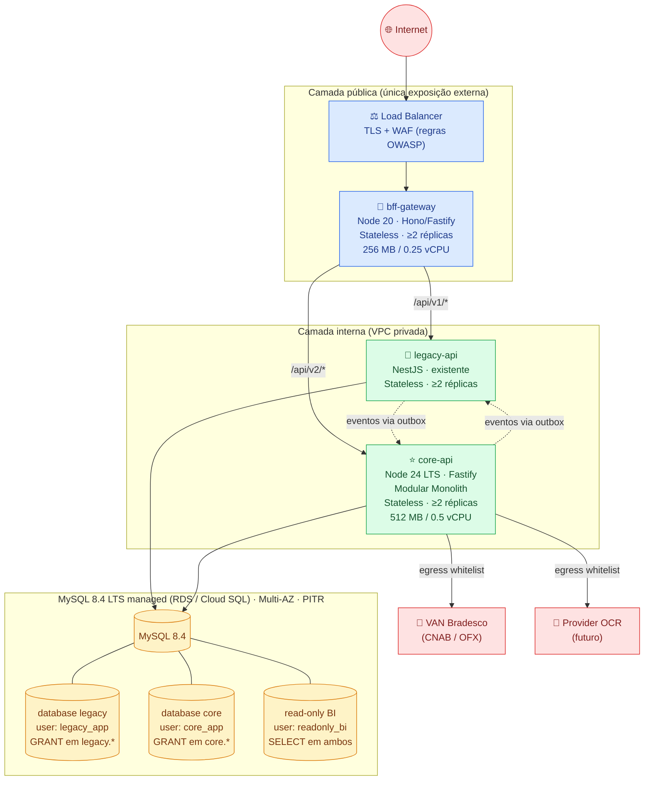
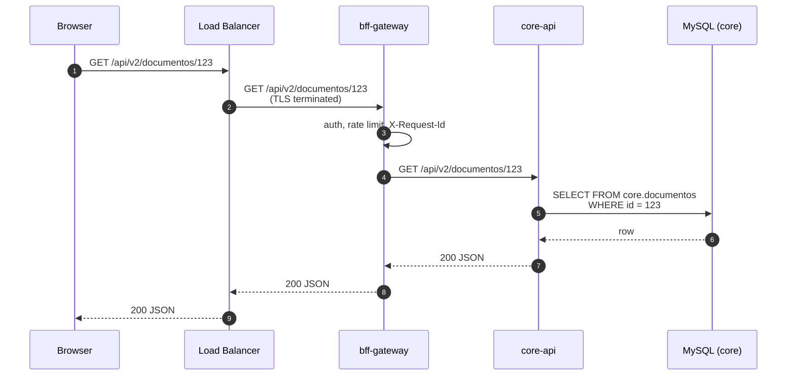
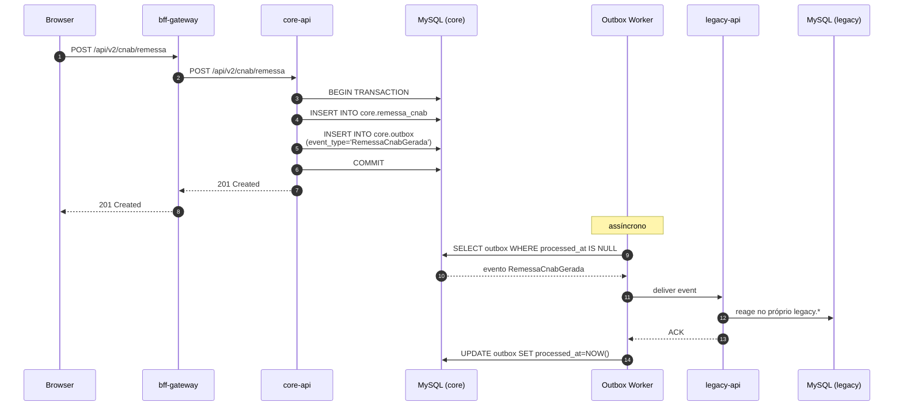

[← Voltar para `docs/`](README.md)

# 🏗️ Topologia do Sistema

> **Status:** PLANEJADA — esta é a topologia decidida em ADRs do handbook. Confirmar com o time de infra se a infra REAL provisionada já reflete este desenho. Atualizar quando divergir.
>
> **Fontes-fonte da decisão:** [handbook architecture/02-system-topology.md](https://github.com/ERP-Bem-Comum) e [handbook infrastructure/01-infra-handoff.md](https://github.com/ERP-Bem-Comum).

---

## 1. Visão de componentes (planejada)



### Princípios invioláveis

1. **BFF nunca toca em DB.** Ele só conhece HTTP.
2. **Cada serviço escreve só no próprio database.** `core-api` em `core.*`, `legacy-api` em `legacy.*`. Sem exceções.
3. **Toda comunicação cross-BC é via evento (outbox).** Sem chamada HTTP síncrona entre `legacy-api` e `core-api`.
4. **Sem joins cross-database entre serviços.** Se precisa de dado do outro, lê via API ou via projeção mantida no próprio database.
5. **Falha de um serviço não derruba o outro.** Eventos ficam empilhados na outbox até voltar.

---

## 2. Fluxo: leitura em tela nova



---

## 3. Fluxo: escrita com efeito cross-bounded-context



---

## 4. Banco de dados — estrutura de isolamento

```mermaid
flowchart LR
    subgraph MYSQL["MySQL 8.4 LTS · Multi-AZ · PITR · binlog"]
        direction TB

        subgraph LEGACY_DB[database: legacy]
            T1[tabelas legacy<br/>(carga inicial do dump)]
        end

        subgraph CORE_DB[database: core]
            T2[tabelas fin_*<br/>módulo Financeiro]
            T3[tabelas ctr_*<br/>módulo Contratos]
            T4[tabela outbox]
        end
    end

    UAPP1["user: legacy_app<br/>GRANT ALL ON legacy.*"] --> LEGACY_DB
    UAPP2["user: core_app<br/>GRANT ALL ON core.*"] --> CORE_DB
    UBI["user: readonly_bi<br/>SELECT em ambos"] --> LEGACY_DB
    UBI --> CORE_DB

    classDef user fill:#e0e7ff,stroke:#4f46e5,color:#312e81
    class UAPP1,UAPP2,UBI user
```

> ⚠️ **O isolamento por GRANT de usuário é a única coisa que impede um dev de violar a regra de domínio. Não negocie.** O sistema operacional não tem como detectar `JOIN legacy.x` em queries do `core-api` — só o MySQL, via permissão negada.

Detalhes em [handbook architecture/03-data-architecture.md](https://github.com/ERP-Bem-Comum) e ADR-0014.

---

## 5. Egress / conectividade externa

| Origem | Destino | Porta | Propósito | Status |
|---|---|---|---|---|
| `core-api` | VAN Bradesco | a confirmar | CNAB / OFX | 🔵 planejado |
| `core-api` | Provider OCR | a definir | Processamento de documentos | 🔵 planejado (provedor a contratar) |
| `legacy-api` | (o que já consome hoje) | — | Manter funcionamento legado | 🔵 herdado |
| Todos | Secrets Manager | 443 | Leitura de credenciais | 🔵 planejado |
| Todos | Coletor de logs/métricas | 443 | Observabilidade | 🔵 planejado |

🔵 = planejado · 🟢 = provisionado e validado · 🔴 = divergência conhecida

> **Time de Infra**: por favor atualizem a coluna Status quando provisionarem cada rota.

---

## 6. Mudanças nesta topologia

Mudanças nesta página exigem:

1. PR em `ERP-INFRA` com diff do Mermaid e descrição do "porquê"
2. Aprovação de **1 dev sênior + 1 líder de infra** (ver [`CODEOWNERS`](../CODEOWNERS))
3. Se a mudança vier de uma decisão arquitetural maior, criar uma ADR em [`docs/adr/`](adr/) **antes** ou **junto** ao PR

---

## 7. Referências

- [`environments.md`](environments.md) — diferenças entre dev / staging / prod
- [`secrets.md`](secrets.md) — catálogo de secrets que esta topologia consome
- [`observability.md`](observability.md) — onde olhar quando algo quebra
- [`adr/`](adr/) — decisões arquiteturais específicas deste repo
- Handbook arquitetural — fonte canônica das decisões originais (`ADR-0005`, `ADR-0006`, `ADR-0013`, `ADR-0014` referenciados acima)
