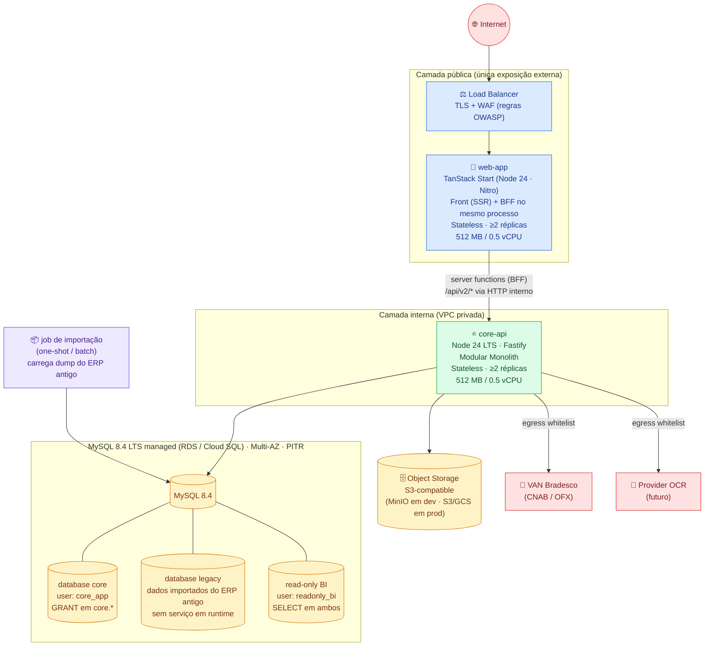
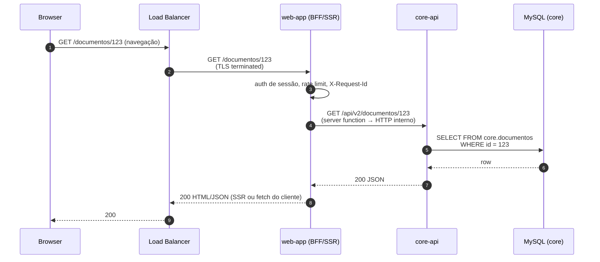
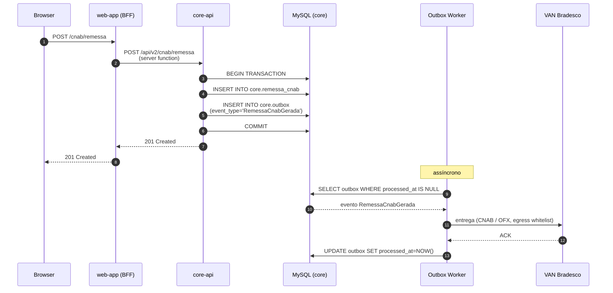
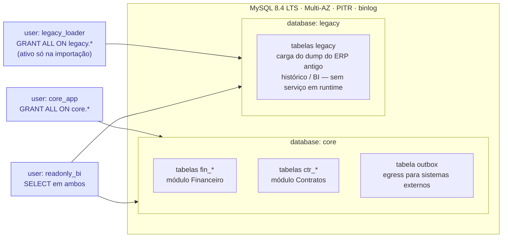

[← Voltar para `docs/`](README.md)

# 🏗️ Topologia do Sistema

> **Status:** PLANEJADA (alvo de produção) — esta é a topologia decidida em ADRs do handbook. Descreve o **alvo de produção** (alta disponibilidade), não o que sobe no dev local (isso fica em [`../local/README.md`](../local/README.md)). Confirmar com o time de infra se a infra REAL provisionada já reflete este desenho. Atualizar quando divergir.
>
> ✅ **A produção já roda neste alvo de HA — em AWS ECS.** Ver [`adr/0003-producao-aws-ecs.md`](adr/0003-producao-aws-ecs.md). A infra **traduz o `compose.yaml` do core-api** em ECS: a **API** fica atrás do **ELB** (substitui o Caddy/edge como borda), com **múltiplas réplicas**; o banco é **RDS** (MySQL gerenciado, não no mesmo host); os segredos vivem no **Secrets Manager**; e-mail via **Amazon SES (SMTP)**. Os 5 workers do profile `workers` são ECS Services **sem ELB**. O baseline econômico single-node em **AWS Lightsail** ([`ADR-0002`](adr/0002-producao-economica-aws-lightsail.md)) foi **descartado**. Os ambientes econômicos (`qa` na Magalu, `x99` no homelab) seguem single-node com Caddy + Docker Compose. A imagem do `web-app` é **distroless non-root** (web-app ADR-0015) e expõe `/health` + `/ready`.
>
> **Fontes-fonte da decisão:** [handbook architecture/02-system-topology.md](https://github.com/ERP-Bem-Comum) e [handbook infrastructure/01-infra-handoff.md](https://github.com/ERP-Bem-Comum).

---

## 1. Visão de componentes (planejada)

### Princípios invioláveis

1. **O BFF (web-app, server-side) nunca toca em DB.** Ele só conhece HTTP: serve o front (SSR) e, via server functions, chama o `core-api`. O browser nunca fala com o `core-api` direto.
2. **Só o `core-api` escreve em runtime, e só no database `core`.** O database `legacy` guarda os dados importados do ERP antigo; **nenhum serviço o serve via API em runtime** — é fonte histórica / BI, populada por job de importação.
3. **Isolamento por GRANT de usuário é inegociável.** `core_app` só enxerga `core.*`; `readonly_bi` só faz `SELECT`. O carregamento de `legacy.*` usa um usuário de importação dedicado, ativo **apenas** durante a migração.
4. **Sem joins cross-database em runtime.** Se o `core-api` precisa de dado do legado, lê via projeção mantida no próprio `core.*` (materializada na importação), nunca com `JOIN legacy.x`.
5. **Comunicação com sistemas externos é via outbox.** Efeitos colaterais para fora (VAN/CNAB, OCR) saem por entrega assíncrona confiável (outbox + worker), não no caminho síncrono da request.

> 📌 **Mudança vs. desenho anterior:** não há mais `bff-gateway` como serviço separado (o BFF é o próprio `web-app`/TanStack Start) nem `legacy-api` rodando (o legado é o frontend congelado `web-app-legacy` + os **dados** importados no database `legacy`). O outbox deixou de ser canal cross-BC `legacy ↔ core` e passou a ser o canal de **egress** do `core-api` para sistemas externos.

---

## 2. Fluxo: leitura em tela nova

---

## 3. Fluxo: escrita com efeito em sistema externo (egress confiável)

> O outbox garante que o efeito externo acontece **exatamente uma vez** mesmo se a VAN estiver fora: o evento fica empilhado até a entrega confirmar. A request do usuário não espera o egress.

---

## 4. Banco de dados — estrutura de isolamento

> ⚠️ **O isolamento por GRANT de usuário é a única coisa que impede um dev/serviço de violar a regra de domínio. Não negocie.** O `core-api` se conecta como `core_app` e, por permissão negada do MySQL, **não consegue** tocar em `legacy.*` — nem por engano, nem de propósito. O acesso de leitura ao legado (BI, conferência de migração) passa por `readonly_bi`.

Detalhes em [handbook architecture/03-data-architecture.md](https://github.com/ERP-Bem-Comum) e ADR-0014.

---

## 5. Egress / conectividade externa

| Origem | Destino | Porta | Propósito | Status |
|---|---|---|---|---|
| `core-api` | VAN Bradesco | a confirmar | CNAB / OFX (via outbox) | 🔵 planejado |
| `core-api` | Provider OCR | a definir | Processamento de documentos | 🔵 planejado (provedor a contratar) |
| `core-api` | Object Storage (S3-compat) | 443 | Anexos / documentos | 🔵 planejado (MinIO em dev) |
| Todos | Secrets Manager | 443 | Leitura de credenciais | 🔵 planejado |
| Todos | Coletor de logs/métricas | 443 | Observabilidade | 🔵 planejado |

🔵 = planejado · 🟢 = provisionado e validado · 🔴 = divergência conhecida

> **Time de Infra**: por favor atualizem a coluna Status quando provisionarem cada rota.

---

## 6. Mudanças nesta topologia

Mudanças nesta página exigem:

1. PR em `ERP-INFRA` com diff do Mermaid e descrição do "porquê"
2. Aprovação de **1 dev sênior + 1 líder de infra** (ver [`CODEOWNERS`](../CODEOWNERS))
3. Se a mudança vier de uma decisão arquitetural maior, criar uma ADR em [`docs/adr/`](adr/) **antes** ou **junto** ao PR

---

## 7. Referências

- [`environments.md`](environments.md) — diferenças entre dev / staging / prod
- [`secrets.md`](secrets.md) — catálogo de secrets que esta topologia consome
- [`observability.md`](observability.md) — onde olhar quando algo quebra
- [`adr/`](adr/) — decisões arquiteturais específicas deste repo
- Handbook arquitetural — fonte canônica das decisões originais (`ADR-0005`, `ADR-0006`, `ADR-0013`, `ADR-0014` referenciados acima)
